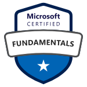

# Microsoft Exam: PL-900

## Overview

As a candidate for this certification, you aspire to understand how Microsoft Power Platform technologies can be used to:

* Develop tailored business solutions.
* Identify how Microsoft Dataverse supports the interoperability of Microsoft Power Platform.
* Accelerate business outcomes by using Microsoft Power Apps for low code/no code solutions.
* Improve processes by using Microsoft Power Automate and Process mining.
* Identify use cases for Microsoft Power Pages.
* Help make data-driven technology decisions by using Microsoft Power BI.
* Evaluate how Copilot can assist with each of these.
* The certification is intended for you if you’re seeking to start your journey building solutions with Microsoft Power Platform.

You can use this certification to prepare for role-based or specialty certifications, but it’s not a prerequisite for any of them.

## Skills at a glance

* Describe the business value of Microsoft Power Platform (20–25%)
* Identify foundational components of Microsoft Power Platform (10–15%)
* Demonstrate the capabilities of Power BI (10–15%)
* Demonstrate the capabilities of Power Apps (20–25%)
* Demonstrate the capabilities of Power Automate (10–15%)
* Demonstrate the capabilities of Power Pages (1–5%)
* Describe the AI authoring experience in Microsoft Power Platform (10–15%)

## Links

* [GitHub](https://github.com/MicrosoftLearning/PL-900-Microsoft-Power-Platform-Fundamentals)
* [MS Labs](https://microsoftlearning.github.io/PL-900-Microsoft-Power-Platform-Fundamentals/)
* [Microsoft Study Guide](https://learn.microsoft.com/en-us/credentials/certifications/resources/study-guides/pl-900)
* [Microsoft Exam](https://learn.microsoft.com/en-us/certifications/exams/pl-900)
* [Microsoft Practice Assessment](https://learn.microsoft.com/en-us/certifications/resources/practice-assessments/pl-900)
* https://learn.microsoft.com/en-us/credentials/certifications/power-platform-fundamentals/?source=recommendations&practice-assessment-type=certification
* https://learn.microsoft.com/en-us/training/paths/power-platform-fundamentals/?source=recommendations
* https://learn.microsoft.com/en-us/credentials/certifications/power-platform-fundamentals/?source=recommendations&practice-assessment-type=certification

