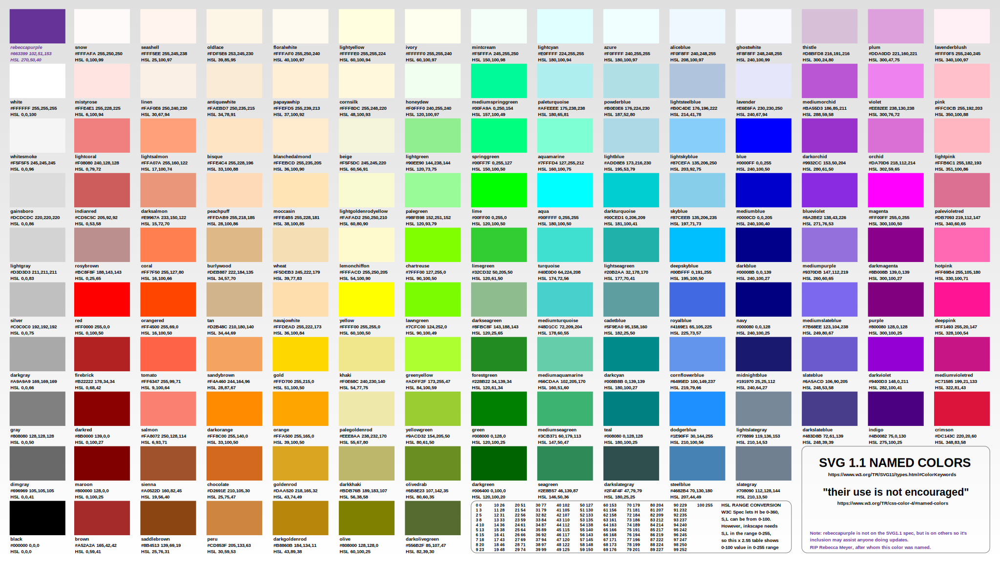

# Color

- [Color Collection](color-collection.md) (all 140 web colors defined in a Power Apps collection)

## Omatsuri 

Omatsuri is a collection of tools and resources for Power Apps, Power Automate, and Power BI. It includes a variety of components, templates, and utilities to help you build better applications and automate your workflows.

- [Color Shades Generator](https://omatsuri.app/color-shades-generator)
- [Gradient Generator](https://omatsuri.app/gradient-generator)

## Color Conversions

- [[HEX-2-RGB]]
- [[HSV-2-RGB]]
- [[RGB-2-HSL]]
- [[RGB-2-HSV]] 

--- 

https://en.wikipedia.org/wiki/Web_colors

