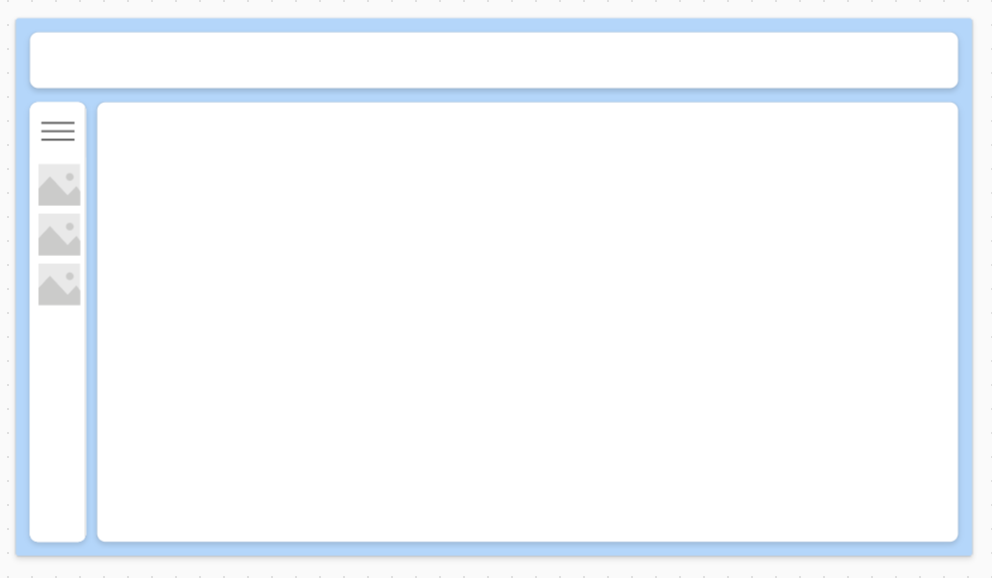

# Left Nav Bar

- Look at this menu in action [here](example-left-nav-bar.png).
- Down below, there is a 2nd YAML code block that you could paste in to import this whole screen!
- There are two code blocks below!



```YAML
ComponentDefinitions:
  compSideNavMenu:
    DefinitionType: CanvasComponent
    CustomProperties:
      AutoRefreshColors:
        PropertyKind: Input
        DisplayName: Auto Refresh Colors
        Description: Auto Refresh Colors
        RaiseOnReset: true
        DataType: Boolean
        Default: =false
      BackgroundColor:
        PropertyKind: Input
        DisplayName: Background Color
        Description: Background Color
        RaiseOnReset: true
        DataType: Color
        Default: =ColorValue("#ffffff")
      ForegroundColor:
        PropertyKind: Input
        DisplayName: Foreground Color
        Description: Foreground Color
        RaiseOnReset: true
        DataType: Color
        Default: =compSideNavMenu.ForegroundColorOutput
      ForegroundColorOutput:
        PropertyKind: Output
        DisplayName: Foreground Color Output
        Description: Foreground Color Output
        DataType: Color
      GroupsUserIsIn:
        PropertyKind: Input
        DisplayName: Groups User Is In
        Description: Groups User Is In
        DataType: Text
        Default: |-
          ="User;" // Replace this string with all the named groups the current user is in, separated by a semicolon: i.e. "User;Admins;Devs;"
      HighLightBackcolor:
        PropertyKind: Input
        DisplayName: HighLight Backcolor
        Description: HighLight Backcolor
        DataType: Color
        Default: =Color.LightYellow
      HoverFill:
        PropertyKind: Input
        DisplayName: Hover Fill
        Description: A custom property
        DataType: Color
        Default: =RGBA(0, 0, 0, 10%)
      IconsOrImages:
        PropertyKind: Input
        DisplayName: Icons or Images
        Description: Icons or Images
        DataType: Text
        Default: ="Images"
      IconsOrImagesOutput:
        PropertyKind: Output
        DisplayName: Icons or Images Output
        Description: Icons or Images Output
        DataType: Text
      IsExpanded:
        PropertyKind: Output
        DisplayName: Is Expanded
        Description: Is Expanded
        DataType: Boolean
      MenuItems:
        PropertyKind: Input
        DisplayName: Menu Items
        Description: Menu Items
        RaiseOnReset: true
        DataType: Table
        Default: |-
          =Table(
              {
                  MenuLabel: "Home Screen",
                  MenuImage: SampleImage,
                  MenuIcon: Icon.Home,
                  ShowForThisRole: "User",
                  ScreenToGoTo: 'Home Screen',
                  Visible: true,
                  LaunchLink: false,
                  LaunchURL: ""
              },
              {
                  MenuLabel: "New Screen",
                  MenuImage: SampleImage,
                  MenuIcon: Icon.DetailList,
                  ShowForThisRole: "User",
                  ScreenToGoTo: 'TEMP - NEW SCREEN',
                  Visible: true,
                  LaunchLink: false,
                  LaunchURL: ""
              },
              {
                  MenuLabel: "Application Administration",
                  MenuImage: SampleImage,
                  MenuIcon: Icon.Settings,
                  ShowForThisRole: "gblIsAppAdmin",
                  ScreenToGoTo: 'ADMIN - App Admin Screen',
                  Visible: true,
                  LaunchLink: false,
                  LaunchURL: ""
              },
              {
                  MenuLabel: "Developer Screen",
                  MenuImage: SampleImage,
                  MenuIcon: Icon.Key,
                  ShowForThisRole: "gblIsAppDeveloper",
                  ScreenToGoTo: 'DEV - Developer Dashboard Screen',
                  Visible: true,
                  LaunchLink: false,
                  LaunchURL: ""
              },
              {
                  MenuLabel: "Web Site",
                  MenuImage: SampleImage,
                  MenuIcon: Icon.Diamond,
                  ShowForThisRole: "User",
                  ScreenToGoTo: Blank(),
                  Visible: true,
                  LaunchLink: true,
                  LaunchURL: "https://powerappstutorial.com/"
              }
          )
      MenuWidth:
        PropertyKind: Output
        DisplayName: Menu Width
        Description: Menu Width
        DataType: Number
      ScreenTransition:
        PropertyKind: Input
        DisplayName: Screen Transition
        Description: A custom property
        DataType: Text
        Default: |+
          =With(
              {
                  RandomNumber: RandBetween(1, 5)
              },
              Switch(
                  RandomNumber,
                  1, ScreenTransition.Cover,
                  2, ScreenTransition.CoverRight,
                  3, ScreenTransition.Fade,
                  4, ScreenTransition.UnCover,
                  5, ScreenTransition.UnCoverRight,
                  ScreenTransition.None
              )
          )


      ShowDottedOutline:
        PropertyKind: Input
        DisplayName: Show Dotted Outline
        Description: Show Dotted Outline
        DataType: Boolean
        Default: =true
      ShowSideBars:
        PropertyKind: Input
        DisplayName: Show Side Bars
        Description: Show Side Bars
        RaiseOnReset: true
        DataType: Boolean
        Default: =true
    Properties:
      Fill: =compSideNavMenu.BackgroundColor
      ForegroundColorOutput: =ColorValue("#666666")
      Height: =668
      IconsOrImagesOutput: =varIconsOrImagesOutput
      IsExpanded: =varOpenUp
      MenuWidth: =If(varOpenUp, 80, 400)
      OnReset: =Set(varTimerGo, true);
      Width: =If(compSideNavMenu.IsExpanded, 550, 80)
    Children:
      - galleryMenuItems:
          Control: Gallery@2.15.0
          Variant: Vertical
          Properties:
            BorderColor: =RGBA(0, 18, 107, 1)
            DelayItemLoading: =false
            Fill: =compSideNavMenu.BackgroundColor
            Height: =Parent.Height - Self.Y
            ItemAccessibleLabel: =ThisItem.MenuLabel
            Items: |-
              =Filter(
                  compSideNavMenu.MenuItems,
                  Visible = true And ShowForThisRole in ForAll(Split(
                      compSideNavMenu.GroupsUserIsIn,
                      ";"
                  ), {Result: ThisRecord.Value})
              )
            LoadingSpinner: =LoadingSpinner.None
            OnSelect: |-
              =Set(
                  varOpenUp,
                  false
              );
              If(
                  Not ThisItem.LaunchLink,
                  Navigate(
                      ThisItem.ScreenToGoTo,
                      compSideNavMenu.ScreenTransition
                  );,
                  Launch(
                      ThisItem.LaunchURL,
                      {},
                      LaunchTarget.New
                  );
                  Navigate(
                      ThisItem.ScreenToGoTo,
                      compSideNavMenu.ScreenTransition
                  );
              );
            ShowNavigation: =true
            ShowScrollbar: =false
            TemplatePadding: =4
            TemplateSize: =67
            Transition: =Transition.Push
            Width: =Parent.Width
            Y: =80
          Children:
            - Rectangle4:
                Control: Rectangle@2.3.0
                Properties:
                  BorderColor: =RGBA(0, 18, 107, 1)
                  Fill: =If(App.ActiveScreen = ThisItem.ScreenToGoTo, compSideNavMenu.HighLightBackcolor, RGBA(0, 0, 0, 0))
                  Height: =imgMenu.Height
                  OnSelect: =Select(Parent)
                  Tooltip: =ThisItem.MenuLabel
                  Width: =Parent.TemplateWidth - 10  //imgMenu.Width
                  X: =imgMenu.X
                  Y: =imgMenu.Y
            - imgMenu:
                Control: Image@2.2.3
                Properties:
                  BorderColor: =RGBA(0, 0, 0, 1)
                  Height: =60
                  Image: =ThisItem.MenuImage
                  OnSelect: =Select(Parent)
                  Tooltip: =ThisItem.MenuLabel
                  Visible: =Lower(varIconsOrImagesOutput) = "images" Or Lower(compSideNavMenu.IconsOrImages) = "images"
                  Width: =60
                  X: =8
                  Y: =4
            - retBar:
                Control: Rectangle@2.3.0
                Properties:
                  BorderColor: =RGBA(0, 18, 107, 1)
                  Fill: =If(IsBlankOrError(varForeColor), icoHamburger.Color, varForeColor) //If(IsBlankOrError(varForeColor), ColorValue("#666666"), varForeColor)
                  Height: =imgMenu.Height
                  OnSelect: =Select(Parent)
                  Tooltip: =ThisItem.MenuLabel
                  Visible: =App.ActiveScreen = ThisItem.ScreenToGoTo
                  Width: =4
                  Y: =imgMenu.Y
            - Label6:
                Control: Label@2.5.1
                Properties:
                  BorderColor: =RGBA(0, 18, 107, 1)
                  Color: =If(IsBlankOrError(compSideNavMenu.ForegroundColor), icoHamburger.Color, compSideNavMenu.ForegroundColor)
                  Font: =Font.'Open Sans'
                  Height: =65
                  HoverFill: =Self.Color
                  OnSelect: =Select(Parent)
                  Size: =16
                  Text: =ThisItem.MenuLabel & If(ThisItem.LaunchLink, "  ↗", "")
                  Tooltip: =ThisItem.MenuLabel
                  Width: =Parent.Width - Self.X - 8
                  X: =84
                  Y: =3
            - icoMenu:
                Control: Classic/Icon@2.5.0
                Properties:
                  AccessibleLabel: =ThisItem.MenuLabel
                  BorderColor: =RGBA(0, 18, 107, 1)
                  Color: =If(IsBlankOrError(varForeColor), icoHamburger.Color, varForeColor)
                  Height: =imgMenu.Height
                  Icon: =ThisItem.MenuIcon
                  OnSelect: =Select(Parent)
                  PaddingBottom: =8
                  PaddingLeft: =8
                  PaddingRight: =8
                  PaddingTop: =8
                  Tooltip: =ThisItem.MenuLabel
                  Visible: =Lower(varIconsOrImagesOutput) = "icons" Or Lower(compSideNavMenu.IconsOrImages) = "icons"
                  Width: =imgMenu.Width
                  X: =imgMenu.X
                  Y: =imgMenu.Y
            - recDotted:
                Control: Rectangle@2.3.0
                Properties:
                  BorderColor: =If(IsBlankOrError(varForeColor), icoHamburger.Color, varForeColor)
                  BorderStyle: =BorderStyle.Dotted
                  BorderThickness: =1
                  Fill: =RGBA(56, 96, 178, 0)
                  Height: =imgMenu.Height
                  OnSelect: =Select(Parent)
                  Tooltip: =ThisItem.MenuLabel
                  Visible: =App.ActiveScreen = ThisItem.ScreenToGoTo And compSideNavMenu.ShowDottedOutline
                  Width: '=Parent.TemplateWidth - 10 '
                  X: =imgMenu.X
                  Y: =imgMenu.Y
            - Icon2:
                Control: Classic/Icon@2.5.0
                Properties:
                  BorderColor: =Self.Fill
                  Color: =Color.Transparent
                  Height: =Parent.TemplateHeight
                  Icon: =Icon.Add
                  OnSelect: =Select(Parent)
                  Width: =Parent.TemplateWidth
            - btnHoverAndClick:
                Control: Classic/Button@2.2.0
                Properties:
                  BorderColor: =ColorFade(Self.Fill, -15%)
                  BorderThickness: =4
                  Color: =compSideNavMenu.ForegroundColor
                  DisabledBorderColor: =RGBA(166, 166, 166, 1)
                  DisabledColor: =Color.Transparent
                  DisabledFill: =Color.Transparent
                  Fill: =Color.Transparent
                  Font: =Font.'Open Sans'
                  Height: =Parent.TemplateHeight
                  HoverBorderColor: =compSideNavMenu.HoverFill
                  HoverColor: =compSideNavMenu.ForegroundColor
                  HoverFill: =compSideNavMenu.HoverFill
                  OnSelect: =Select(Parent)
                  PressedBorderColor: =Self.Fill
                  PressedColor: =ColorFade(compSideNavMenu.BackgroundColor, -25%)
                  PressedFill: =compSideNavMenu.HoverFill
                  RadiusBottomLeft: =6
                  RadiusBottomRight: =6
                  RadiusTopLeft: =6
                  RadiusTopRight: =6
                  Text: =
                  Width: =Parent.TemplateWidth
      - icoHamburger:
          Control: Classic/Icon@2.5.0
          Properties:
            BorderColor: =RGBA(0, 18, 107, 1)
            Color: =compSideNavMenu.ForegroundColor  //RGBA(102, 102, 102, 1)
            Height: =80
            Icon: =Icon.Hamburger
            OnSelect: =Set(varOpenUp, !(varOpenUp = true))
            PaddingBottom: =16
            PaddingLeft: =16
            PaddingRight: =16
            PaddingTop: =16
            Width: =80
      - Timer1:
          Control: Timer@2.1.0
          Properties:
            AutoStart: =true
            BorderColor: =ColorFade(Self.Fill, -15%)
            Color: =RGBA(255, 255, 255, 1)
            DisabledBorderColor: =ColorFade(Self.BorderColor, 70%)
            DisabledColor: =ColorFade(Self.Fill, 90%)
            DisabledFill: =ColorFade(Self.Fill, 70%)
            Duration: =1
            Fill: =RGBA(56, 96, 178, 1)
            Font: =Font.'Open Sans'
            Height: =42
            HoverBorderColor: =ColorFade(Self.BorderColor, 20%)
            HoverColor: =RGBA(255, 255, 255, 1)
            HoverFill: =ColorFade(RGBA(56, 96, 178, 1), -20%)
            OnTimerEnd: =Set(varForeColor, icoHamburger.Color);Set(varIconsOrImagesOutput, lblIconsOrImages.Text);Set(varTimerGo, false);
            OnTimerStart: =Set(varForeColor, icoHamburger.Color);Set(varIconsOrImagesOutput, lblIconsOrImages.Text);
            PressedBorderColor: =Self.Fill
            PressedColor: =Self.Fill
            PressedFill: =Self.Color
            Repeat: =varTimerGo
            Visible: =false
            Width: =80
            Y: =568
      - Label9:
          Control: Label@2.5.1
          Properties:
            BorderColor: =RGBA(0, 18, 107, 1)
            Font: =Font.'Open Sans'
            Text: '=Lower(compSideNavMenu.IconsOrImages) '
            Visible: =false
            Width: =80
            Y: =628
      - Label10:
          Control: Label@2.5.1
          Properties:
            BorderColor: =RGBA(0, 18, 107, 1)
            Font: =Font.'Open Sans'
            Text: =Lower(compSideNavMenu.IconsOrImages) = "images"
            Visible: =false
            Width: =80
            Y: =570
      - Label11:
          Control: Label@2.5.1
          Properties:
            BorderColor: =RGBA(0, 18, 107, 1)
            Font: =Font.'Open Sans'
            Text: =Lower(compSideNavMenu.IconsOrImages)
            Visible: =false
            Y: =454
      - Label12:
          Control: Label@2.5.1
          Properties:
            BorderColor: =RGBA(0, 18, 107, 1)
            Font: =Font.'Open Sans'
            Visible: =false
            Y: =494
      - Rectangle3:
          Control: Rectangle@2.3.0
          Properties:
            BorderColor: =RGBA(0, 18, 107, 1)
            Fill: =ColorValue("#aaaaaa")
            Height: =Parent.Height
            Width: =1
            X: =Parent.Width - 1
      - lblIconsOrImages:
          Control: Label@2.5.1
          Properties:
            BorderColor: =RGBA(0, 18, 107, 1)
            Font: =Font.'Open Sans'
            Text: =compSideNavMenu.IconsOrImages
            Visible: =false
            Y: =484
```

```YAML
Screens:
  Screen With Menu:
    Children:
      - ScreenContainer1:
          Control: GroupContainer@1.3.0
          Variant: AutoLayout
          Properties:
            Fill: =RGBA(180, 214, 250, 1)
            Height: =Parent.Height
            LayoutAlignItems: =LayoutAlignItems.Stretch
            LayoutDirection: =LayoutDirection.Vertical
            PaddingBottom: =10
            PaddingLeft: =10
            PaddingRight: =10
            PaddingTop: =10
            Width: =Parent.Width
          Children:
            - BottomContainer1_1:
                Control: GroupContainer@1.3.0
                Variant: AutoLayout
                Properties:
                  DropShadow: =DropShadow.None
                  Fill: =Color.Transparent
                  FillPortions: =0
                  Height: =100
                  LayoutAlignItems: =LayoutAlignItems.Stretch
                  LayoutDirection: =LayoutDirection.Horizontal
                  LayoutGap: =16
                  LayoutJustifyContent: =LayoutJustifyContent.SpaceBetween
                  LayoutWrap: =true
                  PaddingBottom: =10
                  PaddingLeft: =10
                  PaddingRight: =10
                  PaddingTop: =10
                Children:
                  - Container32:
                      Control: GroupContainer@1.3.0
                      Variant: AutoLayout
                      Properties:
                        DropShadow: =DropShadow.Regular
                        Fill: =RGBA(255, 255, 255, 1)
                        FillPortions: =0
                        Height: =Parent.Height - Parent.PaddingTop * 2
                        LayoutDirection: =LayoutDirection.Horizontal
                        LayoutMinHeight: =50
                        RadiusBottomLeft: =12
                        RadiusBottomRight: =12
                        RadiusTopLeft: =12
                        RadiusTopRight: =12
                        Width: =Parent.Width - Parent.PaddingLeft * 2
            - BottomContainer1:
                Control: GroupContainer@1.3.0
                Variant: AutoLayout
                Properties:
                  DropShadow: =DropShadow.None
                  Fill: =Color.Transparent
                  LayoutAlignItems: =LayoutAlignItems.Stretch
                  LayoutDirection: =LayoutDirection.Horizontal
                  LayoutGap: =16
                  LayoutJustifyContent: =LayoutJustifyContent.SpaceBetween
                  LayoutWrap: =true
                  PaddingBottom: =10
                  PaddingLeft: =10
                  PaddingRight: =10
                  PaddingTop: =10
                Children:
                  - SidebarContainer1:
                      Control: GroupContainer@1.3.0
                      Variant: AutoLayout
                      Properties:
                        DropShadow: =DropShadow.Regular
                        Fill: =RGBA(255, 255, 255, 1)
                        FillPortions: =0
                        LayoutDirection: =LayoutDirection.Vertical
                        LayoutMinHeight: =Parent.Height - 100
                        LayoutMinWidth: =80
                        RadiusBottomLeft: =12
                        RadiusBottomRight: =12
                        RadiusTopLeft: =12
                        RadiusTopRight: =12
                        Width: '=compSideNavMenu_1.Width '
                      Children:
                        - compSideNavMenu_1:
                            Control: CanvasComponent
                            ComponentName: compSideNavMenu
                            Properties:
                              AutoRefreshColors: =false
                              BackgroundColor: =ColorValue("#ffffff")
                              Fill: =compSideNavMenu_1.BackgroundColor
                              ForegroundColor: =compSideNavMenu_1.ForegroundColorOutput
                              GroupsUserIsIn: |-
                                ="User;" // Replace this string with all the named groups the current user is in, separated by a semicolon: i.e. "User;Admins;Devs;"
                              Height: '=Parent.Height '
                              HighLightBackcolor: =Color.LightYellow
                              HoverFill: =RGBA(0, 0, 0, 10%)
                              IconsOrImages: ="Images"
                              MenuItems: |-
                                =Table(
                                    {
                                        MenuLabel: "Home Screen",
                                        MenuImage: SampleImage,
                                        MenuIcon: Icon.Home,
                                        ShowForThisRole: "User",
                                        ScreenToGoTo: 'Home Screen',
                                        Visible: true,
                                        LaunchLink: false,
                                        LaunchURL: ""
                                    },
                                    {
                                        MenuLabel: "New Screen",
                                        MenuImage: SampleImage,
                                        MenuIcon: Icon.DetailList,
                                        ShowForThisRole: "User",
                                        Visible: true,
                                        LaunchLink: false,
                                        LaunchURL: ""
                                    },
                                    {
                                        MenuLabel: "Application Administration",
                                        MenuImage: SampleImage,
                                        MenuIcon: Icon.Settings,
                                        ShowForThisRole: "gblIsAppAdmin",
                                        Visible: true,
                                        LaunchLink: false,
                                        LaunchURL: ""
                                    },
                                    {
                                        MenuLabel: "Developer Screen",
                                        MenuImage: SampleImage,
                                        MenuIcon: Icon.Key,
                                        ShowForThisRole: "gblIsAppDeveloper",
                                        Visible: true,
                                        LaunchLink: false,
                                        LaunchURL: ""
                                    },
                                    {
                                        MenuLabel: "Web Site",
                                        MenuImage: SampleImage,
                                        MenuIcon: Icon.Diamond,
                                        ShowForThisRole: "User",
                                        ScreenToGoTo: Blank(),
                                        Visible: true,
                                        LaunchLink: true,
                                        LaunchURL: "https://powerappstutorial.com/"
                                    }
                                )
                              ScreenTransition: |+
                                =With(
                                    {
                                        RandomNumber: RandBetween(1, 5)
                                    },
                                    Switch(
                                        RandomNumber,
                                        1, ScreenTransition.Cover,
                                        2, ScreenTransition.CoverRight,
                                        3, ScreenTransition.Fade,
                                        4, ScreenTransition.UnCover,
                                        5, ScreenTransition.UnCoverRight,
                                        ScreenTransition.None
                                    )
                                )


                              ShowDottedOutline: =true
                              ShowSideBars: =true
                              Width: =If(compSideNavMenu_1.IsExpanded, 550, 80)
                  - MainContainer1:
                      Control: GroupContainer@1.3.0
                      Variant: AutoLayout
                      Properties:
                        DropShadow: =DropShadow.Regular
                        Fill: =RGBA(255, 255, 255, 1)
                        FillPortions: =7
                        LayoutDirection: =LayoutDirection.Vertical
                        RadiusBottomLeft: =12
                        RadiusBottomRight: =12
                        RadiusTopLeft: =12
                        RadiusTopRight: =12

```
