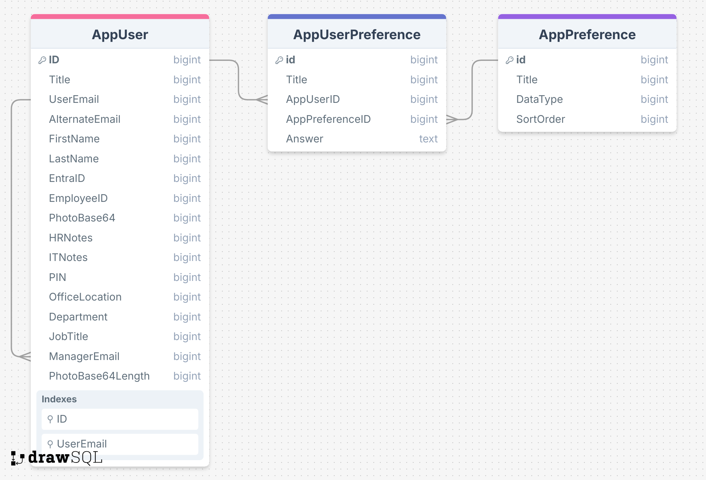

# Read Me

This folder is all about code that uses the Office365users connector.

## You May be interested in the following:

- [People Picker Combobox](PeoplePIckerCombobox.md)

# Create Database Tables

You may want to create data sources to hold the org chart data. This will keep you from having to use the Office365Users connector to make many calls each time you need data. This becomes evident in an example where you have a gallery control listing all the staff in a department or the whole organization. Can you imagine how inefficient it would be to call methods on this connector for each row?

[Sample ERD hosted in DrawSQL ⬇️](https://drawsql.app/teams/neeseus/diagrams/org-chart-profile-data)

