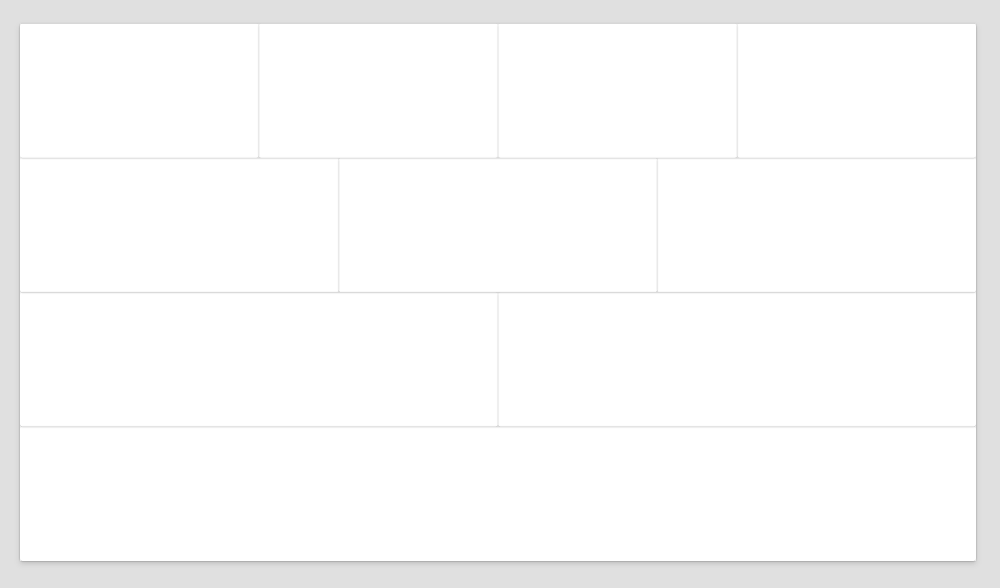

# Funnel Layout for Power Apps

This is a simple snippet that can help you get started with creating a screen in canvas app. It is a set of containers with various number of columns. The first container has 4 columns, the second container has 3 columns, the third container has 2 columns, and the fourth container has 1 column.

All credit goes to Daniel Laskewitz	GitHub (@Laskewitz )
- https://github.com/laskewitz
- https://github.com/pnp/powerplatform-snippets/tree/main/power-apps/layout-funnel




## Add This to Your Application

```YAML
- MainContainerFunnelScreen:
    Control: GroupContainer
    Variant: verticalAutoLayoutContainer
    Properties:
      Height: =Parent.Height
      LayoutAlignItems: =LayoutAlignItems.Stretch
      LayoutDirection: =LayoutDirection.Vertical
      LayoutJustifyContent: =LayoutJustifyContent.Center
      LayoutMode: =LayoutMode.Auto
      Width: =Parent.Width
    Children:
    - Container1FunnelScreen:
        Control: GroupContainer
        Variant: horizontalAutoLayoutContainer
        Properties:
          LayoutMode: =LayoutMode.Auto
        Children:
        - Container11FunnelScreen:
            Control: GroupContainer
            Variant: horizontalAutoLayoutContainer
            Properties:
              LayoutMode: =LayoutMode.Auto
        - Container12FunnelScreen:
            Control: GroupContainer
            Variant: horizontalAutoLayoutContainer
            Properties:
              LayoutMode: =LayoutMode.Auto
        - Container13FunnelScreen:
            Control: GroupContainer
            Variant: horizontalAutoLayoutContainer
            Properties:
              LayoutMode: =LayoutMode.Auto
        - Container14FunnelScreen:
            Control: GroupContainer
            Variant: horizontalAutoLayoutContainer
            Properties:
              LayoutMode: =LayoutMode.Auto
    - Container2FunnelScreen:
        Control: GroupContainer
        Variant: horizontalAutoLayoutContainer
        Properties:
          LayoutMode: =LayoutMode.Auto
        Children:
        - Container21FunnelScreen:
            Control: GroupContainer
            Variant: horizontalAutoLayoutContainer
            Properties:
              LayoutMode: =LayoutMode.Auto
        - Container22FunnelScreen:
            Control: GroupContainer
            Variant: horizontalAutoLayoutContainer
            Properties:
              LayoutMode: =LayoutMode.Auto
        - Container23FunnelScreen:
            Control: GroupContainer
            Variant: horizontalAutoLayoutContainer
            Properties:
              LayoutMode: =LayoutMode.Auto
    - Container3FunnelScreen:
        Control: GroupContainer
        Variant: horizontalAutoLayoutContainer
        Properties:
          LayoutMode: =LayoutMode.Auto
        Children:
        - Container31FunnelScreen:
            Control: GroupContainer
            Variant: horizontalAutoLayoutContainer
            Properties:
              LayoutMode: =LayoutMode.Auto
        - Container32FunnelScreen:
            Control: GroupContainer
            Variant: horizontalAutoLayoutContainer
            Properties:
              LayoutMode: =LayoutMode.Auto
    - Container4FunnelScreen:
        Control: GroupContainer
        Variant: horizontalAutoLayoutContainer
        Properties:
          LayoutMode: =LayoutMode.Auto
```

## Free Community & Course Materials 

🆓 Get access to our free Power Apps crash course (and our community) here: 
- https://tinyurl.com/DarrensStuffFree 🔗

## Support

I hope you have found this helpful. If you need any help with the Power Platform, don't hesitate to email us at 
* [support@superpowerlabs.co](support@superpowerlabs.co)
* https://superpowerlabs.co 

---

## Disclaimer

**THIS CODE IS PROVIDED AS IS WITHOUT WARRANTY OF ANY KIND, EITHER EXPRESS OR IMPLIED, INCLUDING ANY IMPLIED WARRANTIES OF FITNESS FOR A PARTICULAR PURPOSE, MERCHANTABILITY, OR NON-INFRINGEMENT.**


