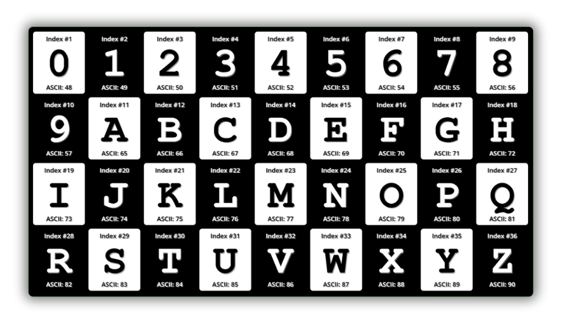

# README: Gallery Control

| 01 | 02 |
|:--------:|:--------:|
| <a href="Simple-Elegant.md">Simple & Elegant | <a href="alternating-row-colors.md">Alternating Row Colors</a> |
| |  |
| <a href="AsciiCodeCheckerBoard.md">Checker Board | <a href="alternating-row-colors.md">Checker Board</a> |
| |  |