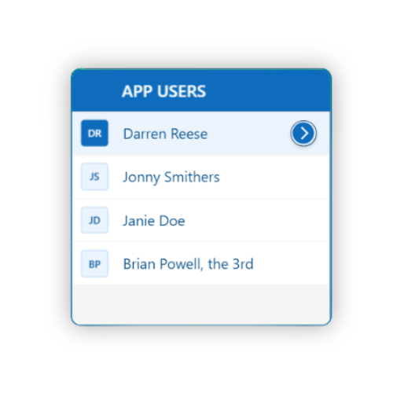

# Simple, Yet Elegant

A full description of how this snippet was created, look at the bottom of this page.

## Visual Demo




## PowerFx code

```PowerFx- ctrGalleryContainingShadow:
Control: GroupContainer@1.3.0
    Variant: AutoLayout
    Properties:
      BorderStyle: =BorderStyle.Dotted
      DropShadow: =DropShadow.None
      Height: =348
      LayoutDirection: =LayoutDirection.Vertical
      PaddingBottom: =30
      PaddingLeft: =20
      PaddingRight: =20
      PaddingTop: =20
      Width: =350
      X: =222
      Y: =225
    Children:
      - cntGalleryGrouping:
          Control: GroupContainer@1.3.0
          Variant: ManualLayout
          Properties:
            BorderColor: =App.Theme.Colors.Primary
            BorderThickness: =2
            DropShadow: =DropShadow.Semibold
            Height: =Parent.Height - Self.Y * 2
            RadiusBottomLeft: =12
            RadiusBottomRight: =12
            RadiusTopLeft: =12
            RadiusTopRight: =12
            Width: =612
            X: =40
            Y: =40
          Children:
            - galListing:
                Control: Gallery@2.15.0
                Variant: Vertical
                Properties:
                  BorderColor: =App.Theme.Colors.Primary
                  BorderThickness: =2
                  Fill: =ColorValue("#f5f5f5")
                  Height: =Parent.Height - Self.Y
                  Items: |-
                    =[
                        {
                            FirstName: "Darren", 
                            LastName: "Reese", 
                            Title: "Darren Reese"
                        },
                        {
                            FirstName: "John", 
                            LastName: "Smith", 
                            Title: "Jonny Smithers"
                        },
                        {
                            FirstName: "Jane", 
                            LastName: "Doe", 
                            Title: "Janie Doe"
                        },
                        {
                            FirstName: "Brian", 
                            LastName: "Powell", 
                            Title: "Brian Powell, the 3rd"
                        }
                    ]
                  TemplateFill: =If(ThisItem.IsSelected, App.Theme.Colors.Lighter80, Color.White)
                  TemplatePadding: =2
                  TemplateSize: =50
                  Transition: =Transition.Push
                  Width: =Parent.Width - Self.X
                  Y: =cntGalleryHeader.Height + cntGalleryHeader.Y
                Children:
                  - lblField02:
                      Control: Label@2.5.1
                      Properties:
                        Color: =fxFontTextColor
                        Height: =Parent.TemplateHeight
                        OnSelect: =Select(Parent)
                        PaddingLeft: =10
                        Text: =ThisItem.Title
                        Width: =lblHeading02.Width
                        X: =lblHeading02.X
                  - BadgeCanvas1:
                      Control: Badge@0.0.24
                      Properties:
                        Appearance: =If(ThisItem.IsSelected, 'BadgeCanvas.Appearance'.Filled, 'BadgeCanvas.Appearance'.Tint)
                        Content: =Left(ThisItem.FirstName, 1) & Left(ThisItem.LastName, 1)
                        Shape: ='BadgeCanvas.Shape'.Rounded
                        ThemeColor: ='BadgeCanvas.ThemeColor'.Brand
                        VerticalAlign: =VerticalAlign.Middle
                        X: =fxConstants.Controls.Margin
                        Y: '=fxGetCenteredDimension(Parent.TemplateHeight, Self.Height) '
            - cntGalleryHeader:
                Control: GroupContainer@1.3.0
                Variant: ManualLayout
                Properties:
                  Fill: =App.Theme.Colors.Primary
                  Height: =50
                  RadiusBottomLeft: =0
                  RadiusBottomRight: =0
                  RadiusTopLeft: =0
                  RadiusTopRight: =0
                  Width: =Parent.Width
                Children:
                  - lblHeading01:
                      Control: Label@2.5.1
                      Properties:
                        Color: =RGBA(255, 255, 255, 1)
                        FontWeight: =FontWeight.Semibold
                        Height: =Parent.Height
                        PaddingLeft: =10
                        Size: =15
                        Text: =
                        Width: =50
                  - lblHeading02:
                      Control: Label@2.5.1
                      Properties:
                        Color: =RGBA(255, 255, 255, 1)
                        FontWeight: =FontWeight.Semibold
                        Height: =Parent.Height
                        PaddingLeft: =10
                        Size: =15
                        Text: ="APP USERS"
                        Width: =Parent.Width - Self.X
                        X: =lblHeading01.X + lblHeading01.Width
```


## Description of the code snippet

### GroupContainer

- **Styling**
    - Fill: Primary color
    - Shadow: Semi-bold drop shadow
    - Border: 
        - Color: Matches primary fill
        - Thickness: 2px
    - Radius: 12px (all corners)
- **Dimensions**
  - Width: Matches parent container
  - Height: Parent container height minus top/bottom padding
- **Positioning**
  - 40px from parent's left/top edges

### Header
- **Visual Design**
  - Text: "APP USERS" in white (semi-bold)
  - Fill: Primary color
  - Border: Bottom border matching primary color
- **Layout**
  - Height: 50px
  - Padding: Left 10px
  - Radius: 0px (all corners)
  - Width: Matches parent container
- **Position**
  - Fixed at container top

### Gallery
- **Layout**
  - Direction: Vertical
  - Transition: Push effect
- **Dimensions**
  - Width: Parent width minus left/right padding
  - Height: Parent height minus header height & top padding
- **Positioning**
  - Below header
  - 40px from container's left/top edges
- **Visual Elements**
  - Background: Light gray fill
  - Border: Thin primary color outline
  - Items:
    - Default: Light gray fill
    - Selected: White fill
    - Height: 50px
    - Padding: 2px
    - Content:
      - First + Last Name
      - User Title
      - **Badge**
        - Style: Rounded brand-color
        - Content: First initials
        - Alignment: Vertical center

### Responsive Behavior
- Automatic adjustment to parent container dimensions
- Dynamic positioning relative to header and container edges
