# Catching All Errors in Power Apps

## Table of Contents

- [⚡ Quick Start](#quick-start)
- [How It Works](#how-it-works)
  - [Deduplication + Cooldown](#deduplication-cooldown)
  - [What the Cooldown Does](#what-the-cooldown-does)
  - [Result: Smart Email Grouping](#result-smart-email-grouping)
- [Step 1: Configure Settings](#step-1-configure-settings)
- [Customizing the Email Design](#customizing-the-email-design)
  - [Option A: Use the Visual Preview Tool (Recommended)](#option-a-use-the-visual-preview-tool-recommended)
  - [Option B: Edit Colors Directly in PowerFx](#option-b-edit-colors-directly-in-powerfx)
  - [Color Theme Examples](#color-theme-examples)
- [Step 2: Add Error Handler](#step-2-add-error-handler)
- [Debugging with Monitor](#debugging-with-monitor)
- [Reference: `colErrorSignatures` Collection](#reference-colerrorsignatures-collection)
- [Optional Enhancements](#optional-enhancements)
  - [Display Errors in Your App](#display-errors-in-your-app)
  - [Clear Errors on App Start](#clear-errors-on-app-start)
  - [Persist Errors to SharePoint/Database](#persist-errors-to-sharepointdatabase)
- [Further Reading](#further-reading)

> 📧 **Get notified of every error without inbox overload** — smart deduplication sends 2 emails instead of 60.

Power Apps can silently swallow errors, leaving users frustrated and developers blind to problems. This error handler catches **every** error in your canvas app and emails you a detailed report — but intelligently groups duplicate errors so you don't get flooded with 50 identical emails.

Whether it's a network timeout, a formula error, or a connector failure, you'll know about it immediately with full context: which screen, which control, the error message, and how many times it occurred.


🎬 [Watch the video tutorial](https://youtu.be/8qcPq4peows)

---

## ⚡ Quick Start

| Step | Action                                                      | Where             |
|:----:|-------------------------------------------------------------|-------------------|
| 1    | Add **Office365Outlook** connector                         | Data → Add data   |
| 2    | Copy [configuration formulas](#step-1-configure-settings)  | `App.Formulas`    |
| 3    | Copy [error handler code](#step-2-add-error-handler)       | `App.OnError`     |

**That's it!** You'll receive email notifications for every unique error.

---

## How It Works

### Deduplication + Cooldown

The error handler uses **signature-based deduplication** combined with a **time-based cooldown** to balance two needs:
1. **Don't flood your inbox** when errors loop rapidly
2. **Do notify you again** when errors recur later

```mermaid
flowchart TD
    A[🔴 Error Occurs] --> B{Generate Signature<br/>Screen &#124; Source &#124; Message}
    B --> C{Seen Before?}

    C -->|No - New Error| D[Add to Collection<br/>Set LastEmailSentTime = Now]
    D --> E[✅ SEND EMAIL]

    C -->|Yes - Existing| F{Cooldown Elapsed?<br/>Now - LastEmailSentTime >= 10s}
    F -->|No| G[Increment Counter Only<br/>❌ No Email]
    F -->|Yes| H[Update LastEmailSentTime = Now]
    H --> E

    style A fill:#fee2e2
    style E fill:#dcfce7
    style G fill:#fef3c7
```



### What the Cooldown Does

| Time | Event | Email Sent? | Why |
|------|-------|:-----------:|-----|
| 10:00:00 | Error A occurs (new) | ✅ Yes | First occurrence |
| 10:00:00.1 | Error A occurs again | ❌ No | Within 10s cooldown |
| 10:00:00.2 | Error A occurs again | ❌ No | Within 10s cooldown |
| 10:00:05 | Error A occurs again | ❌ No | Within 10s cooldown |
| **10:00:15** | **Error A occurs again** | **✅ Yes** | **Cooldown elapsed!** |
| 10:00:16 | Error A occurs again | ❌ No | New cooldown started |

### Result: Smart Email Grouping

| Scenario | Without Cooldown | With 10s Cooldown |
|----------|:----------------:|:-----------------:|
| 100 errors in 1 second | 1 email | 1 email ✓ |
| Same error 5 seconds later | No email | No email ✓ |
| Same error 30 seconds later | No email | **New email** ✓ |
| Different error anytime | New email | New email ✓ |

> 💡 **Configure the cooldown** in `App.Formulas` with `fxErrorEmailCooldownSeconds`. Default is 10 seconds. Set to `0` to only email once per unique error (never re-email).

---

## Step 1: Configure Settings

Copy to **App.Formulas** and update the highlighted values:

```PowerFx
// ══════════════════════════════════════════════════════════════
// ERROR HANDLER SETTINGS
// ══════════════════════════════════════════════════════════════

// 📧 Who receives error emails (semicolon-separated for multiple)
fxErrorHandlerEmail = "YOUR_EMAIL_HERE";

// 📛 App name (shown in email subject/body)
fxApplicationName = "My Power App";

// 🔗 App URL (Player or Studio link from make.powerapps.com)
fxApplicationURL = "https://apps.powerapps.com/";

// ⏱️ Cooldown before same error can trigger another email (in seconds)
// After an email is sent for an error, wait this long before sending another
// for the same error. Prevents email floods while allowing recurring error alerts.
// Set to 0 to only email once per unique error (original behavior).
fxErrorEmailCooldownSeconds = 10;

// 🎨 Email theme colors (customize to match your brand)
fxEmailColors = {
    HeaderBg:       "#dc2626",      // Red banner background
    HeaderText:     "#ffffff",      // White header text
    CardBg:         "#ffffff",      // White card background
    CardBorder:     "#e5e7eb",      // Light gray border
    TableHeaderBg:  "#f9fafb",      // Very light gray
    TableHeaderText:"#374151",      // Dark gray text
    TableBorder:    "#e5e7eb",      // Light gray
    CountBadgeBg:   "#fef2f2",      // Light red background
    CountBadgeText: "#dc2626",      // Red text
    FooterBg:       "#f3f4f6",      // Light gray footer
    FooterText:     "#6b7280",      // Medium gray
    LinkColor:      "#2563eb"       // Blue links
};

// 📖 Error kind descriptions (for hover tooltips in email)
// See: https://learn.microsoft.com/en-us/power-platform/power-fx/reference/function-iferror#error-kinds
fxErrorKinds = [
    { KindName: "None",               KindNumber: 0,  Description: "There's no error." },
    { KindName: "Sync",               KindNumber: 1,  Description: "An error was reported by the data source. Check the Message column for more information." },
    { KindName: "MissingRequired",    KindNumber: 2,  Description: "A required field of a record was missing." },
    { KindName: "CreatePermission",   KindNumber: 3,  Description: "The user doesn't have create record permission for the data source." },
    { KindName: "EditPermissions",    KindNumber: 4,  Description: "The user doesn't have edit record permission for the data source." },
    { KindName: "DeletePermissions",  KindNumber: 5,  Description: "The user doesn't have delete record permission for the data source." },
    { KindName: "Conflict",           KindNumber: 6,  Description: "The record being updated has already been changed at the source." },
    { KindName: "NotFound",           KindNumber: 7,  Description: "Record couldn't be found." },
    { KindName: "ConstraintViolated", KindNumber: 8,  Description: "The record didn't pass a constraint check on the server." },
    { KindName: "GeneratedValue",     KindNumber: 9,  Description: "A value was passed for a field that is auto-calculated by the server." },
    { KindName: "ReadOnlyValue",      KindNumber: 10, Description: "Column is read only and can't be modified." },
    { KindName: "Validation",         KindNumber: 11, Description: "The record didn't pass a validation check." },
    { KindName: "Unknown",            KindNumber: 12, Description: "There was an error, but of an unknown kind." },
    { KindName: "Div0",               KindNumber: 13, Description: "Division by zero." },
    { KindName: "BadLanguageCode",    KindNumber: 14, Description: "An invalid or unrecognized language code was used." },
    { KindName: "BadRegex",           KindNumber: 15, Description: "Invalid regular expression." },
    { KindName: "InvalidFunctionUsage", KindNumber: 16, Description: "Invalid usage of a function." },
    { KindName: "FileNotFound",       KindNumber: 17, Description: "The SaveData storage couldn't be found." },
    { KindName: "AnalysisError",      KindNumber: 18, Description: "System error. There was a problem with compiler analysis." },
    { KindName: "ReadPermission",     KindNumber: 19, Description: "The user doesn't have read record permission for the data source." },
    { KindName: "NotSupported",       KindNumber: 20, Description: "Operation not supported by this player or device." },
    { KindName: "InsufficientMemory", KindNumber: 21, Description: "There isn't enough memory or storage on the device." },
    { KindName: "QuotaExceeded",      KindNumber: 22, Description: "Storage quota exceeded." },
    { KindName: "Network",            KindNumber: 23, Description: "There was a problem with network communications." },
    { KindName: "Numeric",            KindNumber: 24, Description: "A numeric function was used in an improper way." },
    { KindName: "InvalidArgument",    KindNumber: 25, Description: "An invalid argument was passed to a function." },
    { KindName: "Internal",           KindNumber: 26, Description: "System error. There was an internal problem with one of the functions." },
    { KindName: "NotApplicable",      KindNumber: 27, Description: "No value is available." }
];
```

> 💡 **Finding your App URL:** Go to make.powerapps.com → Your App → `...` → Details → Web link

---

## Customizing the Email Design

The error emails use a modern, professional template with color-coded badges and a card layout. You can customize the colors to match your brand using either method below.

### Option A: Use the Visual Preview Tool (Recommended)

An interactive HTML preview file is included so you can see and customize the email design in your browser:

1. **Open the preview:** Open [`email-template-preview.html`](./email-template-preview.html) in any web browser
2. **See sample data:** The preview shows 3 example errors so you can see how real emails will look
3. **Pick your colors:** Use the color picker panel (top-right corner) to adjust:
   - Header background color
   - Count badge colors
   - Button/link color
   - Screen and Kind badge colors
4. **Export to PowerFx:** Click **"📋 Copy PowerFx Colors"** to copy the `fxEmailColors` code
5. **Paste in your app:** Replace the `fxEmailColors` record in your `App.Formulas`

```text
┌─────────────────────────────────────────────────────────────┐
│  email-template-preview.html                                │
│  ┌─────────────────────────────────────┐  ┌──────────────┐  │
│  │                                     │  │ 🎨 Colors    │  │
│  │    Error Alert!                     │  │ [■] Header   │  │
│  │   ┌─────────────────────────────┐   │  │ [■] Badge    │  │
│  │   │ John Doe    [3 errors]      │   │  │ [■] Button   │  │
│  │   │ ─────────────────────────── │   │  │              │  │
│  │   │ 47× │ HomeScreen │ Network  │   │  │ [Copy Code]  │  │
│  │   │ 12× │ Detail     │ Sync     │   │  └──────────────┘  │
│  │   └─────────────────────────────┘   │                    │
│  └─────────────────────────────────────┘                    │
└─────────────────────────────────────────────────────────────┘
```

### Option B: Edit Colors Directly in PowerFx

If you already know your brand colors, edit the `fxEmailColors` record directly:

| Property          | What It Controls              | Default                 |
|-------------------|-------------------------------|-------------------------|
| `HeaderBg`        | Top banner background         | `#dc2626` (red)         |
| `HeaderText`      | Banner text color             | `#ffffff` (white)       |
| `CountBadgeBg`    | Error count badge background  | `#fef2f2` (light red)   |
| `CountBadgeText`  | Error count badge text        | `#dc2626` (red)         |
| `LinkColor`       | "Open App" button             | `#2563eb` (blue)        |
| `CardBg`          | Main card background          | `#ffffff` (white)       |
| `TableHeaderBg`   | Table header row              | `#f9fafb` (light gray)  |
| `FooterBg`        | Summary footer                | `#f3f4f6` (light gray)  |

### Color Theme Examples

<details>
<summary>🔵 Blue Theme (Corporate)</summary>

```PowerFx
fxEmailColors = {
    HeaderBg:       "#1e40af",      // Blue banner
    HeaderText:     "#ffffff",
    CardBg:         "#ffffff",
    CardBorder:     "#e5e7eb",
    TableHeaderBg:  "#eff6ff",      // Light blue
    TableHeaderText:"#1e40af",
    TableBorder:    "#bfdbfe",
    CountBadgeBg:   "#dbeafe",      // Light blue badge
    CountBadgeText: "#1e40af",
    FooterBg:       "#f0f9ff",
    FooterText:     "#6b7280",
    LinkColor:      "#1e40af"
};
```
</details>

<details>
<summary>🟢 Green Theme (Success-focused)</summary>

```PowerFx
fxEmailColors = {
    HeaderBg:       "#059669",      // Green banner
    HeaderText:     "#ffffff",
    CardBg:         "#ffffff",
    CardBorder:     "#e5e7eb",
    TableHeaderBg:  "#ecfdf5",      // Light green
    TableHeaderText:"#065f46",
    TableBorder:    "#a7f3d0",
    CountBadgeBg:   "#d1fae5",      // Light green badge
    CountBadgeText: "#059669",
    FooterBg:       "#f0fdf4",
    FooterText:     "#6b7280",
    LinkColor:      "#059669"
};
```
</details>

<details>
<summary>🟣 Purple Theme (Modern)</summary>

```PowerFx
fxEmailColors = {
    HeaderBg:       "#7c3aed",      // Purple banner
    HeaderText:     "#ffffff",
    CardBg:         "#ffffff",
    CardBorder:     "#e5e7eb",
    TableHeaderBg:  "#f5f3ff",      // Light purple
    TableHeaderText:"#5b21b6",
    TableBorder:    "#c4b5fd",
    CountBadgeBg:   "#ede9fe",      // Light purple badge
    CountBadgeText: "#7c3aed",
    FooterBg:       "#faf5ff",
    FooterText:     "#6b7280",
    LinkColor:      "#7c3aed"
};
```
</details>

<details>
<summary>⬛ Dark Theme</summary>

```PowerFx
fxEmailColors = {
    HeaderBg:       "#1f2937",      // Dark gray banner
    HeaderText:     "#f9fafb",
    CardBg:         "#ffffff",
    CardBorder:     "#e5e7eb",
    TableHeaderBg:  "#f3f4f6",
    TableHeaderText:"#1f2937",
    TableBorder:    "#d1d5db",
    CountBadgeBg:   "#374151",      // Dark badge
    CountBadgeText: "#f9fafb",
    FooterBg:       "#f9fafb",
    FooterText:     "#6b7280",
    LinkColor:      "#1f2937"
};
```
</details>

---

## Step 2: Add Error Handler

Copy to **App.OnError** — no modifications needed:

```PowerFx
// ══════════════════════════════════════════════════════════════
// ERROR HANDLER - Paste into App.OnError (no changes needed)
// ══════════════════════════════════════════════════════════════
With(
    {
        ScreenName:             App.ActiveScreen.Name,
        MyUsersName:            User().FullName,
        MyUsersEmail:           User().Email,
        CurrentTime:            Now(),
        LightGrayColorHexBG:    "background-color:" & fxLightGrayColor & ";",
        CountBefore:            CountRows(colErrorSignatures),
        SubjectLine:            Concatenate(
                                    "Error(s) occurred in the ",
                                    fxApplicationName,
                                    " application for ",
                                    User().FullName
                                )
    },
    // ═══════════════════════════════════════════════════════════════════════
    // DIAGNOSTIC: Log incoming errors (view in Monitor tool)
    // ═══════════════════════════════════════════════════════════════════════
    Trace(
        "ErrorHandler: START",
        TraceSeverity.Information,
        {
            IncomingErrorCount: CountRows(AllErrors),
            ExistingSignatureCount: CountBefore,
            Screen: ScreenName,
            User: MyUsersEmail
        }
    );
    // Process each error - add new signatures or update existing counts
    ForAll(
        AllErrors As Err,
        With(
            {
                // Generate unique signature: Screen|Source|Message
                ErrSignature: ScreenName & "|" & Text(Err.Source) & "|" & Text(Err.Message),
                IsNewError: IsBlank(LookUp(colErrorSignatures, Signature = ScreenName & "|" & Text(Err.Source) & "|" & Text(Err.Message)))
            },
            // ═══════════════════════════════════════════════════════════
            // DIAGNOSTIC: Log each error being processed
            // ═══════════════════════════════════════════════════════════
            Trace(
                "ErrorHandler: Processing Error",
                TraceSeverity.Information,
                {
                    Signature: ErrSignature,
                    IsNew: IsNewError,
                    Kind: Text(Err.Kind),
                    Message: Text(Err.Message)
                }
            );
            If(
                IsNewError,
                // ═══════════════════════════════════════════════════════════
                // NEW UNIQUE ERROR - Add to tracking collection
                // ═══════════════════════════════════════════════════════════
                Collect(
                    colErrorSignatures,
                    {
                        Signature:         ErrSignature,
                        Screen:            ScreenName,
                        Source:            Text(Err.Source),
                        Kind:              Text(Err.Kind),
                        Message:           Text(Err.Message),
                        Observed:          Text(Err.Observed),
                        HttpResponse:      Text(Err.Details.HttpResponse),
                        HttpStatusCode:    Text(Err.Details.HttpStatusCode),
                        Occurrences:       1,
                        FirstOccurrence:   Text(CurrentTime, "MM/dd/yyyy hh:mm:ss AM/PM"),
                        LastOccurrence:    Text(CurrentTime, "MM/dd/yyyy hh:mm:ss AM/PM"),
                        LastEmailSentTime: CurrentTime,    // Track when email was sent for cooldown
                        UserEmail:         MyUsersEmail,
                        UsersName:         MyUsersName
                    }
                ),
                // ═══════════════════════════════════════════════════════════
                // EXISTING ERROR - Increment counter, check cooldown for re-email
                // ═══════════════════════════════════════════════════════════
                With(
                    {
                        ExistingRecord: LookUp(colErrorSignatures, Signature = ErrSignature),
                        CooldownElapsed: fxErrorEmailCooldownSeconds > 0 And
                            DateDiff(
                                LookUp(colErrorSignatures, Signature = ErrSignature).LastEmailSentTime,
                                CurrentTime,
                                TimeUnit.Seconds
                            ) >= fxErrorEmailCooldownSeconds
                    },
                    Patch(
                        colErrorSignatures,
                        ExistingRecord,
                        {
                            Occurrences:       ExistingRecord.Occurrences + 1,
                            LastOccurrence:    Text(CurrentTime, "MM/dd/yyyy hh:mm:ss AM/PM"),
                            // Update LastEmailSentTime if cooldown elapsed (triggers email)
                            LastEmailSentTime: If(CooldownElapsed, CurrentTime, ExistingRecord.LastEmailSentTime)
                        }
                    )
                )
            )
        )
    );
    // ═══════════════════════════════════════════════════════════════════════
    // DIAGNOSTIC: Log collection state before email decision
    // ═══════════════════════════════════════════════════════════════════════
    Trace(
        "ErrorHandler: Pre-Email Check",
        TraceSeverity.Information,
        {
            CountBefore: CountBefore,
            CountAfter: CountRows(colErrorSignatures),
            NewErrorsAdded: CountRows(colErrorSignatures) - CountBefore,
            ErrorsNeedingEmail: CountIf(colErrorSignatures, LastEmailSentTime = CurrentTime),
            WillSendEmail: CountIf(colErrorSignatures, LastEmailSentTime = CurrentTime) > 0,
            TotalOccurrences: Sum(colErrorSignatures, Occurrences)
        }
    );
    // ═══════════════════════════════════════════════════════════════════════
    // SEND EMAIL IF: New error added OR existing error's cooldown elapsed
    // (Any error with LastEmailSentTime = CurrentTime triggers email)
    // ═══════════════════════════════════════════════════════════════════════
    If(
        CountIf(colErrorSignatures, LastEmailSentTime = CurrentTime) > 0,
        // ═══════════════════════════════════════════════════════════════════════
        // DIAGNOSTIC: Log email content details
        // ═══════════════════════════════════════════════════════════════════════
        Trace(
            "ErrorHandler: Sending Email",
            TraceSeverity.Warning,
            {
                To: fxErrorHandlerEmail,
                Subject: SubjectLine,
                UniqueErrorCount: CountRows(colErrorSignatures),
                ErrorSummary: Concat(colErrorSignatures, ThisRecord.Screen & ": " & ThisRecord.Message & " (" & ThisRecord.Occurrences & "×)", ", ")
            }
        );
        Office365Outlook.SendEmailV2(
            fxErrorHandlerEmail,
            SubjectLine,
            $"<html>
            <head>
                <meta charset='utf-8'>
                <meta name='viewport' content='width=device-width, initial-scale=1.0'>
            </head>
            <body style='margin:0;padding:0;font-family:-apple-system,BlinkMacSystemFont,Segoe UI,Roboto,Helvetica,Arial,sans-serif;background-color:#f3f4f6;'>
                <!-- Header Banner -->
                <table width='100%' cellpadding='0' cellspacing='0' style='background-color:{fxEmailColors.HeaderBg};'>
                    <tr>
                        <td style='padding:24px 32px;'>
                            <table width='100%' cellpadding='0' cellspacing='0'>
                                <tr>
                                    <td>
                                        <span style='font-size:28px;'>⚠️</span>
                                        <span style='color:{fxEmailColors.HeaderText};font-size:22px;font-weight:600;margin-left:12px;vertical-align:middle;'>
                                            Error Alert
                                        </span>
                                    </td>
                                    <td style='text-align:right;'>
                                        <span style='color:{fxEmailColors.HeaderText};font-size:14px;opacity:0.9;'>
                                            {Text(CurrentTime, ""mmm dd, yyyy · hh:mm AM/PM"")}
                                        </span>
                                    </td>
                                </tr>
                            </table>
                        </td>
                    </tr>
                </table>

                <!-- Main Content Card -->
                <table width='100%' cellpadding='0' cellspacing='0' style='padding:24px;'>
                    <tr>
                        <td>
                            <table width='100%' cellpadding='0' cellspacing='0' style='background-color:{fxEmailColors.CardBg};border-radius:12px;box-shadow:0 1px 3px rgba(0,0,0,0.1);overflow:hidden;'>
                                <!-- User Info -->
                                <tr>
                                    <td style='padding:24px 24px 16px 24px;border-bottom:1px solid {fxEmailColors.CardBorder};'>
                                        <table width='100%' cellpadding='0' cellspacing='0'>
                                            <tr>
                                                <td>
                                                    <div style='font-size:18px;font-weight:600;color:#111827;margin-bottom:4px;'>
                                                        {MyUsersName}
                                                    </div>
                                                    <div style='font-size:14px;color:#6b7280;'>
                                                        {MyUsersEmail}
                                                    </div>
                                                </td>
                                                <td style='text-align:right;vertical-align:top;'>
                                                    <span style='display:inline-block;background-color:{fxEmailColors.CountBadgeBg};color:{fxEmailColors.CountBadgeText};font-size:14px;font-weight:600;padding:6px 12px;border-radius:20px;'>
                                                        {CountRows(colErrorSignatures)} unique error{If(CountRows(colErrorSignatures)>1,""s"","""")}
                                                    </span>
                                                </td>
                                            </tr>
                                        </table>
                                    </td>
                                </tr>

                                <!-- Error Table -->
                                <tr>
                                    <td style='padding:0;'>
                                        <table width='100%' cellpadding='0' cellspacing='0' style='border-collapse:collapse;'>
                                            <tr style='background-color:{fxEmailColors.TableHeaderBg};'>
                                                <th style='padding:12px 16px;text-align:center;font-size:12px;font-weight:600;color:{fxEmailColors.TableHeaderText};text-transform:uppercase;letter-spacing:0.5px;border-bottom:2px solid {fxEmailColors.TableBorder};width:70px;'>Count</th>
                                                <th style='padding:12px 16px;text-align:left;font-size:12px;font-weight:600;color:{fxEmailColors.TableHeaderText};text-transform:uppercase;letter-spacing:0.5px;border-bottom:2px solid {fxEmailColors.TableBorder};'>Screen</th>
                                                <th style='padding:12px 16px;text-align:left;font-size:12px;font-weight:600;color:{fxEmailColors.TableHeaderText};text-transform:uppercase;letter-spacing:0.5px;border-bottom:2px solid {fxEmailColors.TableBorder};'>Kind</th>
                                                <th style='padding:12px 16px;text-align:left;font-size:12px;font-weight:600;color:{fxEmailColors.TableHeaderText};text-transform:uppercase;letter-spacing:0.5px;border-bottom:2px solid {fxEmailColors.TableBorder};'>Source</th>
                                                <th style='padding:12px 16px;text-align:left;font-size:12px;font-weight:600;color:{fxEmailColors.TableHeaderText};text-transform:uppercase;letter-spacing:0.5px;border-bottom:2px solid {fxEmailColors.TableBorder};'>Message</th>
                                                <th style='padding:12px 16px;text-align:right;font-size:12px;font-weight:600;color:{fxEmailColors.TableHeaderText};text-transform:uppercase;letter-spacing:0.5px;border-bottom:2px solid {fxEmailColors.TableBorder};width:140px;'>Timestamps</th>
                                            </tr>" &
                                            Concat(
                                                colErrorSignatures,
                                                $"<tr style='border-bottom:1px solid {fxEmailColors.TableBorder};'>
                                                    <td style='padding:16px;text-align:center;vertical-align:top;'>
                                                        <span style='display:inline-block;background-color:{fxEmailColors.CountBadgeBg};color:{fxEmailColors.CountBadgeText};font-size:16px;font-weight:700;padding:8px 14px;border-radius:8px;min-width:40px;'>
                                                            {ThisRecord.Occurrences}×
                                                        </span>
                                                    </td>
                                                    <td style='padding:16px;vertical-align:top;'>
                                                        <span style='display:inline-block;background-color:#dbeafe;color:#1e40af;font-size:13px;font-weight:500;padding:4px 10px;border-radius:6px;'>
                                                            {ThisRecord.Screen}
                                                        </span>
                                                    </td>
                                                    <td style='padding:16px;vertical-align:top;'>
                                                        <span style='display:inline-block;background-color:#fef3c7;color:#92400e;font-size:13px;font-weight:500;padding:4px 10px;border-radius:6px;' title='{Substitute(LookUp(fxErrorKinds, KindName = ThisRecord.Kind, Description), "'", "&#39;")}'>
                                                            {ThisRecord.Kind}
                                                        </span>
                                                    </td>
                                                    <td style='padding:16px;vertical-align:top;font-size:14px;color:#374151;font-family:ui-monospace,monospace;'>
                                                        {ThisRecord.Source}
                                                    </td>
                                                    <td style='padding:16px;vertical-align:top;font-size:14px;color:#111827;max-width:300px;'>
                                                        {ThisRecord.Message}
                                                    </td>
                                                    <td style='padding:16px;vertical-align:top;text-align:right;'>
                                                        <div style='font-size:12px;color:#6b7280;margin-bottom:4px;'>
                                                            <strong>First:</strong> {ThisRecord.FirstOccurrence}
                                                        </div>
                                                        <div style='font-size:12px;color:#6b7280;'>
                                                            <strong>Last:</strong> {ThisRecord.LastOccurrence}
                                                        </div>
                                                    </td>
                                                </tr>"
                                            ) & $"
                                        </table>
                                    </td>
                                </tr>

                                <!-- Summary Footer -->
                                <tr>
                                    <td style='padding:20px 24px;background-color:{fxEmailColors.FooterBg};border-top:1px solid {fxEmailColors.CardBorder};'>
                                        <table width='100%' cellpadding='0' cellspacing='0'>
                                            <tr>
                                                <td>
                                                    <span style='font-size:14px;color:{fxEmailColors.FooterText};'>
                                                        <strong style='color:#374151;'>{CountRows(colErrorSignatures)}</strong> unique errors ·
                                                        <strong style='color:#374151;'>{Sum(colErrorSignatures, Occurrences)}</strong> total occurrences
                                                    </span>
                                                </td>
                                                <td style='text-align:right;'>
                                                    <a href='{fxApplicationURL}' style='display:inline-block;background-color:{fxEmailColors.LinkColor};color:#ffffff;font-size:14px;font-weight:500;padding:10px 20px;border-radius:8px;text-decoration:none;'>
                                                        Open {fxApplicationName}
                                                    </a>
                                                </td>
                                            </tr>
                                        </table>
                                    </td>
                                </tr>
                            </table>
                        </td>
                    </tr>
                </table>

                <!-- Footer -->
                <table width='100%' cellpadding='0' cellspacing='0'>
                    <tr>
                        <td style='padding:16px 24px 32px 24px;text-align:center;'>
                            <div style='font-size:12px;color:#9ca3af;'>
                                Automated error report from {fxApplicationName}
                            </div>
                        </td>
                    </tr>
                </table>
            </body>
            </html>"
        )
    );

);
```

---

## Debugging with Monitor

The error handler logs to **Power Apps Monitor** so you can see exactly what's happening.

**To open Monitor:** Power Apps Studio → Advanced tools (`Alt+T`) → Monitor → Play your app

| Trace Event                       | What It Shows                                     |
|-----------------------------------|---------------------------------------------------|
| `ErrorHandler: START`             | How many errors came in, current screen, user     |
| `ErrorHandler: Processing Error`  | Each error's signature and whether it's new       |
| `ErrorHandler: Pre-Email Check`   | Will an email be sent? How many new errors?       |
| `ErrorHandler: Sending Email`     | Email recipient, subject, error summary           |

<details>
<summary>📋 Example Monitor Output</summary>

```
[Information] ErrorHandler: START
    IncomingErrorCount: 3, Screen: "HomeScreen", User: "user@domain.com"

[Information] ErrorHandler: Processing Error
    Signature: "HomeScreen|Button1.OnSelect|Network error"
    IsNew: true, Kind: "Network"

[Information] ErrorHandler: Pre-Email Check
    CountBefore: 0, CountAfter: 1
    ErrorsNeedingEmail: 1, WillSendEmail: true

[Warning] ErrorHandler: Sending Email
    To: "admin@domain.com"
    UniqueErrorCount: 1
    ErrorSummary: "HomeScreen: Network error (1×)"
```

**Cooldown in action:**
```
[Information] ErrorHandler: Pre-Email Check
    CountBefore: 1, CountAfter: 1
    ErrorsNeedingEmail: 0, WillSendEmail: false   ← Same error, still in cooldown

[Information] ErrorHandler: Pre-Email Check
    CountBefore: 1, CountAfter: 1
    ErrorsNeedingEmail: 1, WillSendEmail: true    ← Cooldown elapsed, re-sending!
```

</details>

> 💡 **For production:** Remove the `Trace()` statements to declutter your Monitor.

---

## Reference: `colErrorSignatures` Collection

The error handler automatically creates this collection to track errors:

| Field                                | Type     | Description                                    |
|--------------------------------------|----------|------------------------------------------------|
| `Signature`                          | Text     | Unique key: `Screen\|Source\|Message`          |
| `Screen`                             | Text     | Where the error occurred                       |
| `Source`                             | Text     | Control or function that caused it             |
| `Kind`                               | Text     | Error type (Sync, Network, etc.)               |
| `Message`                            | Text     | The error message                              |
| `Occurrences`                        | Number   | How many times this error happened             |
| `FirstOccurrence` / `LastOccurrence` | Text     | Timestamps (formatted strings)                 |
| `LastEmailSentTime`                  | DateTime | When an email was last sent for this error     |
| `UserEmail` / `UsersName`            | Text     | Who triggered the error                        |
| `HttpResponse` / `HttpStatusCode`    | Text     | API details (if applicable)                    |

---

## Optional Enhancements

### Display Errors in Your App

Add a gallery bound to `colErrorSignatures` on a debug screen:

```PowerFx
// Gallery.Items
colErrorSignatures

// Label formulas
ThisItem.Occurrences & "× - " & ThisItem.Message
```

### Clear Errors on App Start

Add to `App.OnStart` for a fresh collection each session:

```PowerFx
Clear(colErrorSignatures);
```

### Persist Errors to SharePoint/Database

<details>
<summary>📋 Click to expand persistence code</summary>

Create a table/list with columns matching the collection fields, then add to a "Save & Exit" button:

```PowerFx
ForAll(
    colErrorSignatures,
    Patch(
        PowerAppsErrors,        // Your data source
        Defaults(PowerAppsErrors),
        {
            Signature:       Signature,
            Screen:          Screen,
            Source:          Source,
            Kind:            Kind,
            Message:         Message,
            Occurrences:     Occurrences,
            FirstOccurrence: FirstOccurrence,
            LastOccurrence:  LastOccurrence,
            UserEmail:       UserEmail,
            UsersName:       UsersName
        }
    )
);
Clear(colErrorSignatures);
```

</details>

---

## Further Reading

- [Error, IfError, IsError functions](https://learn.microsoft.com/en-us/power-platform/power-fx/reference/function-iferror)
- [Errors function](https://learn.microsoft.com/en-us/power-platform/power-fx/reference/function-errors)
- [Power Fx Error handling](https://learn.microsoft.com/en-us/power-platform/power-fx/error-handling)

---

## History

| Date       | Author          | Changes                                                                                             |
|------------|-----------------|-----------------------------------------------------------------------------------------------------|
| 2025-12-18 | Claude Opus 4.5 | Added hover tooltips on Kind badges showing error description via `fxErrorKinds` LookUp             |
| 2025-12-18 | Claude Opus 4.5 | Added `fxErrorKinds` named formula with all 28 error kinds and descriptions                         |
| 2025-12-18 | Claude Opus 4.5 | Fixed Mermaid diagram parse error by escaping pipe characters with `&#124;` HTML entities           |
| 2025-12-18 | Claude Opus 4.5 | Added time-based cooldown feature with `fxErrorEmailCooldownSeconds` config (default 10s)           |
| 2025-12-18 | Claude Opus 4.5 | Added `LastEmailSentTime` field to collection for cooldown tracking                                 |
| 2025-12-18 | Claude Opus 4.5 | Rewrote "How It Works" section with Mermaid flowchart and cooldown examples                         |
| 2025-12-17 | Claude Opus 4.5 | Added "Customizing the Email Design" section with visual preview instructions and 4 theme examples |
| 2025-12-17 | Claude Opus 4.5 | Redesigned email template with modern styling: header banner, color-coded badges, card layout      |
| 2025-12-17 | Claude Opus 4.5 | Added `fxEmailColors` record for customizable email theming                                         |
| 2025-12-17 | Claude Opus 4.5 | Created `email-template-preview.html` for live preview and color customization                     |
| 2025-12-17 | Claude Opus 4.5 | Rewrote documentation for clarity: added quick-start, visual flow diagram, collapsible sections     |
| 2025-12-17 | Claude Opus 4.5 | Added diagnostic logging with Trace() statements                                                   |
| 2025-12-17 | Claude Opus 4.5 | Fixed multi-row email output with explicit ThisRecord references                                    |
| 2025-12-04 | Claude Opus 4.5 | Implemented v2.2 with signature-based deduplication                                                 |
| 2025-12-04 | Claude Opus 4.5 | Added occurrence counting and full session reports                                                  |
