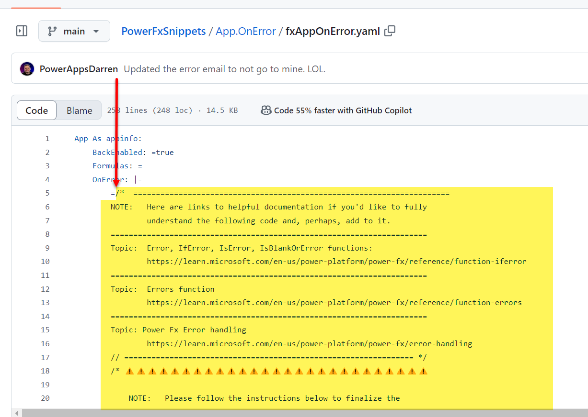
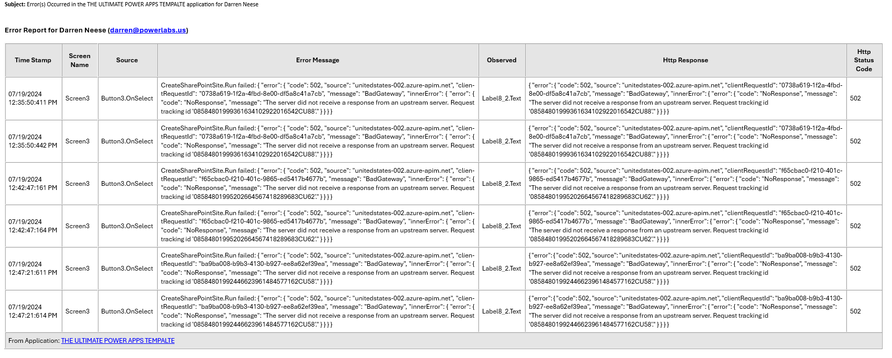

# Read Me 

## Table of Contents

- [all the way down to this point...](#all-the-way-down-to-this-point)

To add this error "catch all" feature to your canvas Power Apps, follow these steps: 

# 1 - Open the [[fxAppOnError.yaml]] file

# 2 - Copy from this point:

## all the way down to this point...

# Or, you can import the [[fxAppOnError.yaml]] file into your environment and inspect and copy the code from there. 

# 3 - Then, follow the steps in the App.OnError event property. 

# Here is a sample email that will be generated and sent out: 

---

## History

| Date | Author | Changes |
|------|--------|---------|
| 2026-01-27 | Migration | Initial TOC and history section added |
