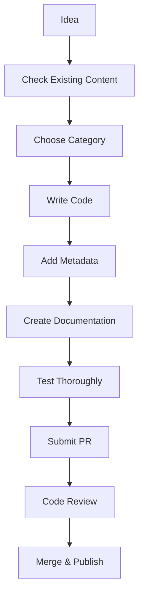

# Documentation 📚

Welcome to the Power Fx Snippets documentation! This directory contains detailed guides, templates, and reference materials to help you make the most of this repository.

## 📋 Table of Contents

### Getting Started
- [Quick Start Guide](./quick-start.md) - Get up and running in 5 minutes
- [Repository Structure](./repository-structure.md) - Understanding the organization
- [Contributing Overview](./contributing-overview.md) - How to contribute effectively

### Guidelines & Standards
- [Snippet Standards](./snippet-standards.md) - Requirements for code snippets
- [Metadata Guide](./metadata-guide.md) - YAML front matter reference
- [Style Guide](./style-guide.md) - Formatting and style standards
- [Testing Guidelines](./testing-guidelines.md) - How to test your contributions

### Advanced Topics
- [Category Selection](./category-selection.md) - Choosing the right category
- [Cross-Referencing](./cross-referencing.md) - Linking related content
- [Performance Considerations](./performance-considerations.md) - Writing efficient code
- [Security Best Practices](./security-best-practices.md) - Secure coding patterns

### Tools & Utilities
- [Validation Scripts](./validation-scripts.md) - Automated checking tools
- [Migration Tools](./migration-tools.md) - Moving existing content
- [Search Optimization](./search-optimization.md) - Making content discoverable

### Templates
- [Snippet Template](./templates/snippet-template.md) - Complete snippet template
- [README Template](./templates/readme-template.md) - Category README template
- [Tutorial Template](./templates/tutorial-template.md) - Learning content template

## 🎯 Quick Navigation

### For New Contributors
1. Read the [Quick Start Guide](./quick-start.md)
2. Review [Snippet Standards](./snippet-standards.md)
3. Use the [Snippet Template](./templates/snippet-template.md)
4. Follow the [Contributing Guide](../CONTRIBUTING.md)

### For Repository Maintainers
1. Check [Validation Scripts](./validation-scripts.md) for automation
2. Use [Migration Tools](./migration-tools.md) for content reorganization
3. Follow [Style Guide](./style-guide.md) for consistency
4. Review [Testing Guidelines](./testing-guidelines.md) for quality assurance

### For Content Consumers
1. Start with [Repository Structure](./repository-structure.md)
2. Use [Search Optimization](./search-optimization.md) tips
3. Follow [Cross-Referencing](./cross-referencing.md) for related content
4. Check [Category Selection](./category-selection.md) for navigation

## 📖 Detailed Guides

### Snippet Creation Process

### Quality Checklist

Before submitting a snippet, ensure:

- [ ] **Metadata Complete**: All required YAML fields present
- [ ] **Code Tested**: Works in Power Apps environment
- [ ] **Documentation Clear**: Examples and explanations provided
- [ ] **Links Valid**: All internal and external links work
- [ ] **Formatting Correct**: Follows style guidelines
- [ ] **No Sensitive Data**: No API keys or personal information
- [ ] **Performance Considered**: Code is efficient and scalable
- [ ] **Error Handling**: Appropriate error handling included

## 🛠️ Tools and Automation

### Validation Tools
- **GitHub Actions**: Automatic validation on PRs
- **Markdown Linter**: Checks formatting consistency
- **YAML Validator**: Ensures metadata correctness
- **Link Checker**: Validates all internal links

### Development Tools
- **Snippet Generator**: Automated template creation
- **Category Indexer**: Auto-generates category listings
- **Search Indexer**: Creates searchable content indexes
- **Migration Scripts**: Automated content reorganization

## 📊 Metrics and Analytics

### Content Quality Metrics
- **Snippet Completeness**: Percentage with full metadata
- **Documentation Coverage**: README completeness score
- **Link Health**: Broken link detection
- **Code Quality**: Automated code analysis results

### Community Metrics
- **Contribution Velocity**: PR acceptance rate
- **Issue Resolution Time**: Average time to resolve issues
- **Community Satisfaction**: User feedback and ratings
- **Content Usage**: Download and reference statistics

## 🔄 Maintenance Procedures

### Regular Tasks
- **Weekly**: Review open issues and PRs
- **Monthly**: Update dependencies and tools
- **Quarterly**: Review and update category structure
- **Annually**: Comprehensive content audit

### Emergency Procedures
- **Security Issues**: Immediate response protocol
- **Breaking Changes**: Communication and migration plan
- **Data Loss**: Backup restoration procedures
- **Community Issues**: Moderation and conflict resolution

## 📞 Support and Help

### Getting Help
- **Documentation Issues**: Create issue with "documentation" label
- **Tool Problems**: Check [Validation Scripts](./validation-scripts.md)
- **Process Questions**: Review [Contributing Guide](../CONTRIBUTING.md)
- **Technical Support**: Contact maintainers

### Community Resources
- [GitHub Discussions](https://github.com/PowerAppsDarren/PowerFxSnippets/discussions)
- [Power Platform Community](https://powerplatform.microsoft.com/community/)
- [Microsoft Learn](https://learn.microsoft.com/en-us/power-platform/)
- [Stack Overflow](https://stackoverflow.com/questions/tagged/powerapps)

---

## 📝 Contributing to Documentation

This documentation is a living resource. Help us improve it by:

1. **Reporting Issues**: Found something unclear or incorrect?
2. **Suggesting Improvements**: Have ideas for better organization?
3. **Adding Content**: Missing a guide or template?
4. **Updating Examples**: Code samples need refreshing?

See our [Contributing Guide](../CONTRIBUTING.md) for details on how to contribute.

---

**Last Updated**: November 2024
**Version**: 1.0.0
**Maintainers**: Power Fx Snippets Team