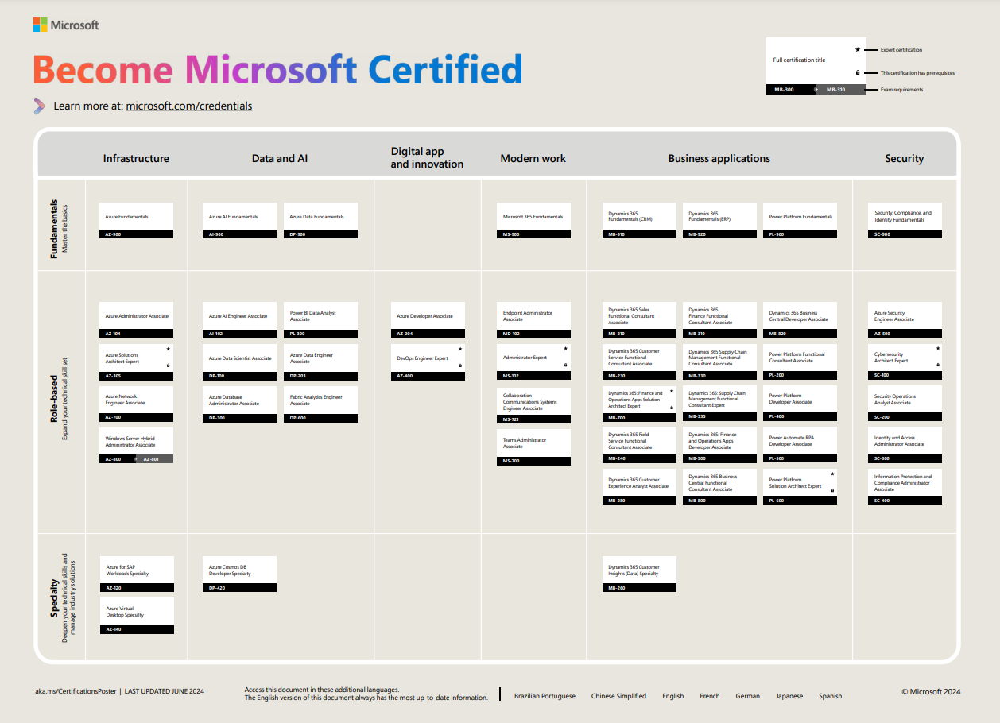

# Microsoft Certification Resources

## Table of Contents

- [Overview](#overview)
- [Directory Structure](#directory-structure)
- [Certification Pathway](#certification-pathway)
- [Available Certifications](#available-certifications)
  - [PL-900: Power Platform Fundamentals](#pl-900-power-platform-fundamentals)
  - [PL-200: Power Platform Functional Consultant](#pl-200-power-platform-functional-consultant)
  - [PL-400: Power Platform Developer](#pl-400-power-platform-developer)
- [Study Tips](#study-tips)
  - [Before the Exam](#before-the-exam)
  - [During the Exam](#during-the-exam)
  - [Exam Format](#exam-format)
- [Additional Resources](#additional-resources)
  - [Official Resources](#official-resources)
  - [Community Resources](#community-resources)
- [Related Content](#related-content)

Study resources and exam preparation for Power Platform certifications.

## Overview

This folder contains resources to help you prepare for Microsoft Power Platform certification exams. Certifications validate your skills and can advance your career.

## Directory Structure

```
certification/
├── pl-900/               # Power Platform Fundamentals
├── pl-200/               # Functional Consultant
├── images/               # Certification pathway images
└── README.md
```

## Certification Pathway




## Available Certifications

### PL-900: Power Platform Fundamentals

**Level:** Beginner
**Role:** Business User, Developer, Functional Consultant

**Skills Measured:**

- Describe Power Platform components (25-30%)
- Describe Power Apps (20-25%)
- Describe Power Automate (15-20%)
- Describe Power Virtual Agents (10-15%)
- Describe AI Builder (10-15%)

**Resources:**

- [Exam Page](https://learn.microsoft.com/en-us/certifications/exams/pl-900)
- [Microsoft Learn Path](https://learn.microsoft.com/en-us/training/paths/power-plat-fundamentals/)
- [Official Study Guide](https://query.prod.cms.rt.microsoft.com/cms/api/am/binary/RE2PjDI)
- [Study Guide](./pl-900/)

### PL-200: Power Platform Functional Consultant

**Level:** Intermediate
**Role:** Functional Consultant

**Skills Measured:**

- Configure Microsoft Dataverse (20-25%)
- Create apps by using Power Apps (20-25%)
- Create and manage Power Automate (15-20%)
- Implement Power Virtual Agents chatbots (10-15%)
- Integrate Power Apps with other apps and services (10-15%)

**Resources:**

- [Exam Page](https://learn.microsoft.com/en-us/certifications/exams/pl-200)
- [Microsoft Learn Path](https://learn.microsoft.com/en-us/training/paths/functional-consultant-power-platform/)
- [Study Guide](./pl-200/)

### PL-400: Power Platform Developer

**Level:** Advanced
**Role:** Developer

**Skills Measured:**

- Create a technical design (15-20%)
- Configure Microsoft Dataverse (10-15%)
- Create and configure Power Apps (15-20%)
- Configure business process automation (15-20%)
- Extend the platform (15-20%)
- Develop integrations (10-15%)

**Resources:**

- [Exam Page](https://learn.microsoft.com/en-us/certifications/exams/pl-400)

## Study Tips

### Before the Exam

1. **Complete Microsoft Learn Paths** - Free, official content
2. **Hands-on Practice** - Build real apps and flows
3. **Review Documentation** - Focus on areas you're weak in
4. **Take Practice Tests** - Get familiar with the format

### During the Exam

1. Read questions carefully
2. Flag difficult questions to review later
3. Manage your time (usually 1 minute per question)
4. Trust your first instinct

### Exam Format

- Multiple choice questions
- Case studies (for higher-level exams)
- Drag and drop scenarios
- Usually 40-60 questions
- 60-90 minutes duration

## Additional Resources

### Official Resources

- [Microsoft Learn](https://learn.microsoft.com/)
- [Power Platform Documentation](https://learn.microsoft.com/en-us/power-platform/)
- [Certification Overview](https://learn.microsoft.com/en-us/certifications/)

### Community Resources

- Power Platform User Groups
- YouTube exam prep videos
- Community blogs and tutorials

## Related Content

- [Tutorials](../tutorials/)
- [Best Practices](../best-practices/)
- [Learning Overview](../README.md)

---

## History

| Date       | Author      | Changes                          |
|------------|-------------|----------------------------------|
| 2026-01-27 | Claude      | Enhanced README with study info  |
