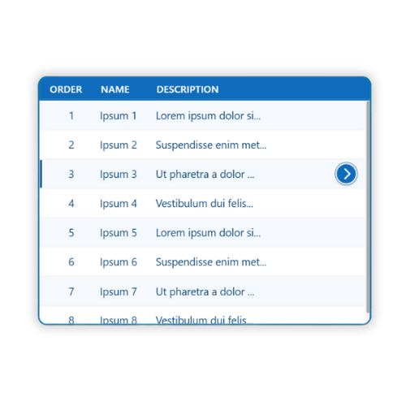
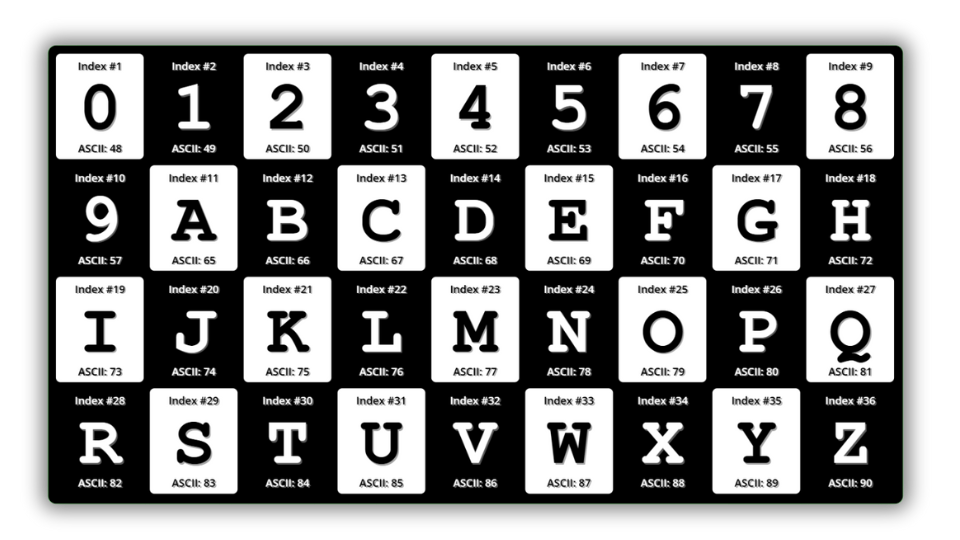

# Gallery Control Snippets

This folder contains Power Fx snippets for the Gallery control in Power Apps Canvas applications. Gallery controls are essential for displaying collections of data in various visual formats.

## Folder Structure

```
gallery/
├── layouts/          # Different gallery layout patterns
├── styling/          # Visual styling and appearance patterns
├── interactions/     # User interaction and behavior patterns
└── images/          # Screenshots and visual examples
```

## Subcategories

### Layouts (`layouts/`)

Gallery layout patterns for different data presentation needs:

| Snippet                                                        | Description                                  | Difficulty   |
|----------------------------------------------------------------|----------------------------------------------|--------------|
| [Simple Gallery](layouts/simple-gallery.md)                   | Basic vertical gallery with selection        | Beginner     |
| [Simple Elegant](layouts/simple-elegant.md)                   | Elegant gallery with header and badges       | Intermediate |
| [Gallery with Headings](layouts/gallery-with-headings.md)     | Multi-column gallery with header row         | Beginner     |
| [Responsive Gallery](layouts/responsive-gallery.md)           | Responsive hero cards with auto wrap         | Intermediate |
| [Modern Cards](layouts/gallery-modern-cards.md)               | Modern card layout with status indicators    | Intermediate |
| [Data Table](layouts/gallery-datatable.md)                    | Professional table with zebra striping       | Intermediate |
| [Timeline](layouts/gallery-timeline.md)                       | Chronological event timeline                 | Intermediate |
| [Status Board](layouts/gallery-statusboard.md)                | Kanban-style task board                      | Intermediate |
| [Image Grid](layouts/gallery-imagegrid.md)                    | Responsive photo gallery grid                | Intermediate |

### Styling (`styling/`)

Visual styling patterns and techniques:

| Snippet                                                         | Description                             | Difficulty   |
|-----------------------------------------------------------------|-----------------------------------------|--------------|
| [Alternating Row Colors](styling/alternating-row-colors.md)    | Zebra striping using Mod function       | Intermediate |
| [ASCII Checkerboard](styling/asciicodecheckerboard.md)         | Checkerboard pattern with ASCII codes   | Intermediate |

### Interactions (`interactions/`)

User interaction and behavior patterns:

| Snippet                                                  | Description                          | Difficulty   |
|----------------------------------------------------------|--------------------------------------|--------------|
| [Nested Galleries](interactions/nested-galleries.md)    | Parent-child gallery relationships   | Intermediate |

## Visual Examples

| Simple & Elegant | Alternating Row Colors |
|:----------------:|:----------------------:|
| [](layouts/simple-elegant.md) | [](styling/alternating-row-colors.md) |

| Checkerboard Pattern |
|:--------------------:|
| [](styling/asciicodecheckerboard.md) |

## Key Concepts

### Gallery Properties

Common gallery properties you'll find in these snippets:

- **Items**: Data source (collection, table, or inline data)
- **TemplateFill**: Background color of each item
- **TemplateSize**: Height/width of each item
- **TemplatePadding**: Spacing between items
- **WrapCount**: Number of columns for grid layouts
- **Layout**: Vertical or Horizontal orientation

### Selection Patterns

Most snippets include selection highlighting:

```powerfx
TemplateFill: =If(ThisItem.IsSelected, Color.LightBlue, Color.White)
```

### Responsive Design

Many layouts use formulas for responsive behavior:

```powerfx
WrapCount: =Max(1, RoundDown((Parent.Width - 64) / 200, 0))
```

## Getting Started

1. Choose a layout that fits your needs
2. Copy the YAML code from the snippet
3. Paste into Power Apps Studio (Edit > Paste as YAML)
4. Modify the `Items` property to use your data source
5. Customize colors and styling as needed

## Related Resources

- [Power Fx Gallery Documentation](https://learn.microsoft.com/power-apps/maker/canvas-apps/controls/control-gallery)
- [Power Platform Links](https://powerplatformlinks.com)

