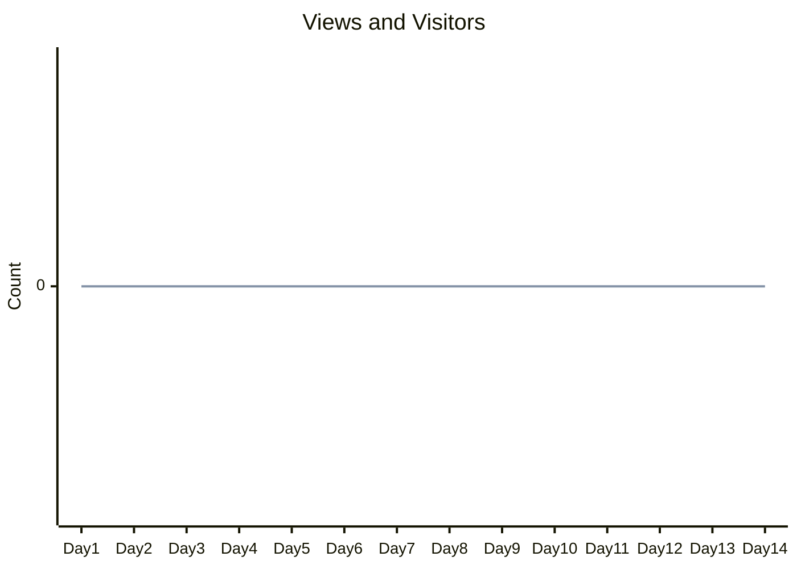
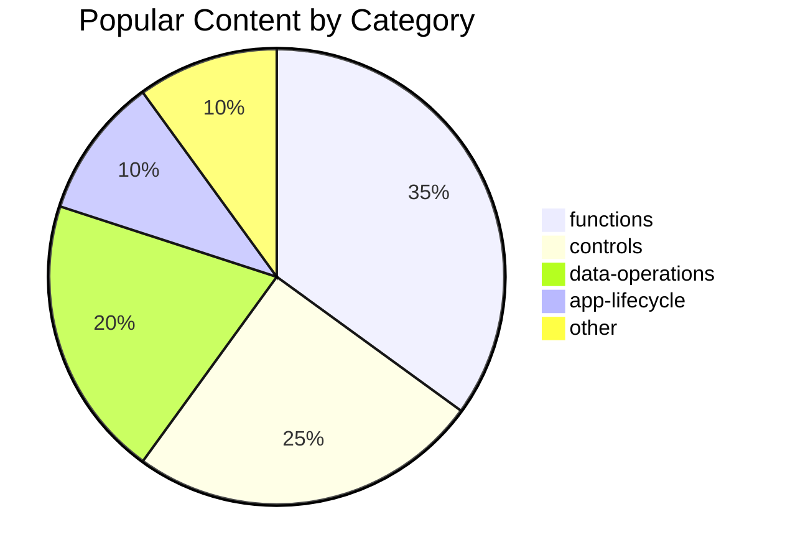

# 📊 Analytics Dashboard Template

Reusable template for weekly and monthly analytics reports.

---

## Report Header

| Field | Value |
|-------|-------|
| **Report Period** | [e.g., "Week of February 1-7, 2026"] |
| **Report Type** | [Weekly / Monthly / Quarterly] |
| **Generated By** | [Manual / Automated] |
| **Last Updated** | [Timestamp] |

---

## Table of Contents

- [Executive Summary](#executive-summary)
- [Traffic Metrics](#traffic-metrics)
- [Top Referrers](#top-referrers)
- [Popular Content](#popular-content)
- [Community Engagement](#community-engagement)
- [Insights & Recommendations](#insights--recommendations)
- [Appendix](#appendix)

---

## Executive Summary

### Key Highlights

- 📈 **[Highlight 1]**: [e.g., "Repository views increased 15% over last week"]
- 🎯 **[Highlight 2]**: [e.g., "Top referrer is now LinkedIn with 45% of traffic"]
- 🌟 **[Highlight 3]**: [e.g., "3 new stars this week, bringing total to 150"]
- 📚 **[Highlight 4]**: [e.g., "Most popular content: 'functions/string-manipulation' category"]
- 🔧 **[Highlight 5]**: [e.g., "No open issues remain - community engagement strong"]

### Period-over-Period Comparison

| Metric | Current Period | Previous Period | Trend |
|--------|---------------|-----------------|-------|
| Total Views | [value] | [value] | [↑/↓/→] |
| Unique Visitors | [value] | [value] | [↑/↓/→] |
| New Stars | [value] | [value] | [↑/↓/→] |
| New Forks | [value] | [value] | [↑/↓/→] |

---

## Traffic Metrics

### Views & Visitors

| Metric | Current Period | Previous Period | Change (%) | Chart |
|--------|---------------|-----------------|------------|-------|
| **Total Views** | [value] | [value] | [+/-X%] | ████████░░ |
| **Unique Visitors** | [value] | [value] | [+/-X%] | ██████░░░░ |

### Clones

| Metric | Current Period | Previous Period | Change (%) | Chart |
|--------|---------------|-----------------|------------|-------|
| **Total Clones** | [value] | [value] | [+/-X%] | ████░░░░░░ |
| **Unique Cloners** | [value] | [value] | [+/-X%] | ███░░░░░░░ |

### Traffic Trend Visualization

*Note: Update chart values with actual GitHub Insights data*

---

## Top Referrers

| Rank | Referrer | Views | % of Total | Trend |
|------|----------|-------|------------|-------|
| 1 | [Site Name] | [value] | [X%] | [↑/↓/→] |
| 2 | [Site Name] | [value] | [X%] | [↑/↓/→] |
| 3 | [Site Name] | [value] | [X%] | [↑/↓/→] |
| 4 | [Site Name] | [value] | [X%] | [↑/↓/→] |
| 5 | [Site Name] | [value] | [X%] | [↑/↓/→] |
| - | **Direct Traffic** | [value] | [X%] | [↑/↓/→] |
| - | **Search Engines** | [value] | [X%] | [↑/↓/→] |

### Referrer Insights

- **Top Source**: [e.g., "Power Platform Community forums driving 32% of traffic"]
- **Emerging Source**: [e.g., "Twitter/X mentions increased 50%"]
- **Opportunity**: [e.g., "Low engagement from Microsoft Docs - consider cross-promotion"]

---

## Popular Content

### Top 10 Most-Viewed Content

| Rank | Path | Views | Category | Trend |
|------|------|-------|----------|-------|
| 1 | `/path/to/file.md` | [value] | [category] | [↑/↓/→] |
| 2 | `/path/to/file.md` | [value] | [category] | [↑/↓/→] |
| 3 | `/path/to/file.md` | [value] | [category] | [↑/↓/→] |
| 4 | `/path/to/file.md` | [value] | [category] | [↑/↓/→] |
| 5 | `/path/to/file.md` | [value] | [category] | [↑/↓/→] |
| 6 | `/path/to/file.md` | [value] | [category] | [↑/↓/→] |
| 7 | `/path/to/file.md` | [value] | [category] | [↑/↓/→] |
| 8 | `/path/to/file.md` | [value] | [category] | [↑/↓/→] |
| 9 | `/path/to/file.md` | [value] | [category] | [↑/↓/→] |
| 10 | `/path/to/file.md` | [value] | [category] | [↑/↓/→] |

### Category Distribution

*Note: Update percentages based on actual popular content data*

---

## Community Engagement

### Growth Metrics

| Metric | Current | Previous | Change | Trend |
|--------|---------|----------|--------|-------|
| ⭐ **Stars** | [value] | [value] | [+/-X] | [↑/↓/→] |
| 🍴 **Forks** | [value] | [value] | [+/-X] | [↑/↓/→] |
| 👁️ **Watchers** | [value] | [value] | [+/-X] | [↑/↓/→] |

### Activity Metrics

| Metric | Current | Previous | Change | Status |
|--------|---------|----------|--------|--------|
| 🐛 **Open Issues** | [value] | [value] | [+/-X] | [🟢/🟡/🔴] |
| 🔄 **Open PRs** | [value] | [value] | [+/-X] | [🟢/🟡/🔴] |
| 📅 **Issues Closed** | [value] | [value] | [+/-X] | - |
| ✅ **PRs Merged** | [value] | [value] | [+/-X] | - |

### Status Legend

- 🟢 Healthy: 0-5 open issues/PRs
- 🟡 Moderate: 6-15 open issues/PRs
- 🔴 Attention Needed: 16+ open issues/PRs

---

## Insights & Recommendations

### 🔍 Key Insights

1. **[Insight 1]**: [Description based on data trends]
2. **[Insight 2]**: [Description based on data trends]
3. **[Insight 3]**: [Description based on data trends]
4. **[Insight 4]**: [Description based on data trends]
5. **[Insight 5]**: [Description based on data trends]

### 💡 Recommendations

#### Content Improvements

- [ ] [Recommendation 1: e.g., "Add more examples to high-traffic pages"]
- [ ] [Recommendation 2: e.g., "Create content for underserved categories"]
- [ ] [Recommendation 3: e.g., "Update outdated snippets based on search queries"]

#### Promotion & Outreach

- [ ] [Recommendation 1: e.g., "Share top content on Power Platform forums"]
- [ ] [Recommendation 2: e.g., "Collaborate with top referrer communities"]
- [ ] [Recommendation 3: e.g., "Create blog post featuring popular snippets"]

#### Community Engagement

- [ ] [Recommendation 1: e.g., "Respond to new issues within 48 hours"]
- [ ] [Recommendation 2: e.g., "Thank contributors of merged PRs publicly"]
- [ ] [Recommendation 3: e.g., "Host monthly community showcase"]

---

## Appendix

### Data Collection Methodology

| Aspect | Details |
|--------|---------|
| **Source** | GitHub Insights → Traffic |
| **Collection Method** | Manual via web UI |
| **Timezone** | UTC+0 |
| **Update Frequency** | Hourly (views/clones), Daily (referrers/content) |
| **Data Window** | 14-day rolling window |

### Known Limitations

1. **14-Day Window**: Historical data beyond 14 days is not available via GitHub web UI
2. **Anonymous Data**: Individual user tracking is not possible
3. **Web UI Only**: No API access for automated collection (requires GitHub Enterprise or custom scripts)
4. **Timezone**: All data is in UTC+0

### Raw Data Sources

- [GitHub Insights Traffic](https://github.com/PowerAppsDarren/PowerFxSnippets/graphs/traffic)
- [Repository Issues](../../../issues)
- [Pull Requests](../../../pulls)

### Related Reports

- [Baseline Metrics](./baseline-metrics.md)
- [Reporting Schedule](./reporting-schedule.md)
- [Previous Weekly Reports](./reports/) (if applicable)

---

## Notes

> **Template Usage**:
> 1. Copy this template for each new report
> 2. Fill in all `[value]` placeholders with actual GitHub Insights data
> 3. Update the mermaid charts with real values
> 4. Add contextual insights based on observed trends
> 5. Save as `YYYY-MM-DD-weekly-report.md` or `YYYY-MM-monthly-report.md`

---

*Generated from [dashboard-template.md](./dashboard-template.md)*
*Last updated: February 2, 2026*
